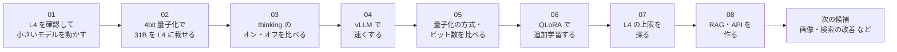

# colab-oss-lab

Google Colab（Google AI Pro の特典）で、公開されているAIモデル（OSSモデル）を試すための学習用リポジトリです。

このリポジトリは、機械学習の専門家向けではありません。  
会社に入りたてのエンジニア、あるいは「GPUという言葉は聞いたことがある」くらいの人を想定しています。

今の自分の環境（2026年9月確認）:

- Google AI Pro の特典で、Colab に `PRO` が付いている
- よく当たるGPUは **NVIDIA L4**（メモリ約22.5GB）
- A100 も選べるが、普段は L4 を使う
- H100 と G4 は、今の契約では選べない

---

## このリポジトリで分かること（解説）

先に読むと実験の意味が分かりやすくなります。各ページの最後に、そのページに関係する実験へのリンクがあります。

1. [Colab とは何か](docs/01-what-is-colab.md)
2. [Google AI Pro で Colab に何が付いたか](docs/02-google-ai-pro.md)
3. [これを使うと、何ができるのか](docs/03-what-you-can-do.md)
4. [OSSモデルを載せると、何ができるのか](docs/04-oss-models.md)
5. [GPU と L4 / A100 の違い](docs/05-gpu-basics.md)
6. [量子化とは何か（なぜ4bitが出てくるのか）](docs/06-quantization.md)
7. [ことばの一覧](docs/glossary.md)

---

## これまでの実験

実験の番号は、**行った順**に付けています（01 → 02 → 03 → 04 → 05 → 06 → 07 → 08）。

| # | 実験 | 使ったモデル | 結果（ひとこと） | 記録 | ノート | 関連する解説 |
|---|---|---|---|---|---|---|
| 01 | L4 の確認と、小さいモデルを1回動かす | Qwen2.5-1.5B-Instruct（量子化なし） | L4（22GB）を確認。動いたが、日本語の説明は不正確 | [記録](docs/results/01_first_run.md) | [ipynb](notebooks/01_l4_check_and_tiny_model.ipynb) / [Colab](<https://colab.research.google.com/github/moruku36/colab-oss-lab/blob/main/notebooks/01_l4_check_and_tiny_model.ipynb>) | [Colab](docs/01-what-is-colab.md)・[GPU](docs/05-gpu-basics.md)・[OSSモデル](docs/04-oss-models.md) |
| 02 | 量子化で L4 に載る「いちばん大きいモデル」 | Gemma 4 31B-it（bitsandbytes 4bit） | 62.5GB → 16.6GB。VRAM 17.0GB で載り、説明も計算も正確。ChatGPT でいうと o3 / o4-mini くらい | [記録と構成図](docs/results/02_quantization_max.md) | [ipynb](notebooks/02_quantize_largest_model_on_l4.ipynb) / [Colab](<https://colab.research.google.com/github/moruku36/colab-oss-lab/blob/main/notebooks/02_quantize_largest_model_on_l4.ipynb>) | [量子化](docs/06-quantization.md)・[GPU](docs/05-gpu-basics.md)・[OSSモデル](docs/04-oss-models.md) |
| 03 | thinking（考えてから答える）のオン・オフ | Gemma 4 31B-it（4bit） | 5問ともどちらも正解。オンは約3.6倍遅い → 普段はオフで十分 | [記録](docs/results/03_thinking_on_off.md) | [ipynb](notebooks/03_thinking_on_off.ipynb) / [Colab](<https://colab.research.google.com/github/moruku36/colab-oss-lab/blob/main/notebooks/03_thinking_on_off.ipynb>) | [OSSモデル](docs/04-oss-models.md) |
| 04 | vLLM で速くする | Gemma 4 31B-it / 26B-A4B（vLLM + AWQ 4bit） | 31B は 2.2倍（13.3 トークン/秒）、MoE の 26B-A4B は 8.8倍（53.5）。正答は同じ | [記録と構成図](docs/results/04_vllm_speedup.md) | [ipynb](notebooks/04_vllm_speedup.ipynb) / [Colab](<https://colab.research.google.com/github/moruku36/colab-oss-lab/blob/main/notebooks/04_vllm_speedup.ipynb>) | [量子化](docs/06-quantization.md)・[何ができるか](docs/03-what-you-can-do.md)・[GPU](docs/05-gpu-basics.md) |
| 05 | 量子化の方式・ビット数を比べる | Qwen3-8B（bf16 / bnb 8bit・4bit / HQQ 4・3・2bit） | 4bit までは賢さほぼ同じ（VRAM 約 1/3）。3bit で崩れ始め、2bit は壊れる | [記録](docs/results/05_quantization_compare.md) | [ipynb](notebooks/05_quantization_compare.ipynb) / [Colab](<https://colab.research.google.com/github/moruku36/colab-oss-lab/blob/main/notebooks/05_quantization_compare.ipynb>) | [量子化](docs/06-quantization.md)・[GPU](docs/05-gpu-basics.md) |
| 06 | QLoRA で追加学習する | Qwen3-8B（4bit NF4）+ LoRA | 学習 1.4分・VRAM 10GB で軽い。同じ聞き方は 92% 覚えたが、聞き方を変えると 44%。書き方が関係ない質問にもにじんだ | [記録](docs/results/06_qlora.md) | [ipynb](notebooks/06_qlora.ipynb) / [Colab](<https://colab.research.google.com/github/moruku36/colab-oss-lab/blob/main/notebooks/06_qlora.ipynb>) | [何ができるか](docs/03-what-you-can-do.md)・[量子化](docs/06-quantization.md) |
| 07 | L4 の上限を探る | Qwen3-32B / Seed-OSS-36B（4bit NF4） | GPU だけに載る上限は 36B（空き 1.9GB）。文章の長さは 32B で 4K、36B で 2K まで。36B MoE は載らない | [記録](docs/results/07_l4_limit.md) | [ipynb](notebooks/07_l4_limit.ipynb) / [Colab](<https://colab.research.google.com/github/moruku36/colab-oss-lab/blob/main/notebooks/07_l4_limit.ipynb>) | [GPU](docs/05-gpu-basics.md)・[OSSモデル](docs/04-oss-models.md) |
| 08 | RAG・API を作る | Gemma 4 26B-A4B（vLLM の OpenAI 互換 API）+ 資料検索 | 06 と同じ 25 問で 64%（LoRA は 44%）。資料にない質問は 5/5 で「記載がありません」。同時に聞くと 3.4 倍速い | [記録](docs/results/08_rag_api.md) | [ipynb](notebooks/08_rag_api.ipynb) / [Colab](<https://colab.research.google.com/github/moruku36/colab-oss-lab/blob/main/notebooks/08_rag_api.ipynb>) | [何ができるか](docs/03-what-you-can-do.md)・[OSSモデル](docs/04-oss-models.md) |

### 実験から分かったこと

| 分かったこと | 根拠 |
|---|---|
| L4（22GB）に 4bit で GPU だけに載る上限は 36B の密モデル。ただし大きいほど扱える文章が短くなる（32B で 4K、36B で 2K トークン） | [02](docs/results/02_quantization_max.md)・[07](docs/results/07_l4_limit.md) |
| 1.5B と 31B では、日本語の説明の正確さがはっきり違う | [01](docs/results/01_first_run.md)・[02](docs/results/02_quantization_max.md) |
| 易しい問題なら thinking は不要。オンにすると思考を書く分だけ遅くなる | [03](docs/results/03_thinking_on_off.md) |
| 速さは「エンジン（vLLM）」と「モデルの型（MoE）」で大きく変わる。bitsandbytes は載せるのは得意だが遅い | [04](docs/results/04_vllm_speedup.md) |
| 31B を vLLM で動かすと、会話の記憶（KV キャッシュ）がほとんど残らない。L4 1枚の普段使いは **vLLM + Gemma 4 26B-A4B（AWQ 4bit）** がおすすめ | [04](docs/results/04_vllm_speedup.md) |
| 量子化は 4bit が落としどころ。8bit はほぼ劣化なしだが遅い、3bit 以下は崩れる。普段は bitsandbytes NF4 | [05](docs/results/05_quantization_compare.md) |
| LoRA は「書き方・口調」はすぐ覚えるが、「新しい事実」は苦手（44%）。事実は RAG（資料検索）の方が正確で（64%）、知らないことは「記載がありません」と言える | [06](docs/results/06_qlora.md)・[08](docs/results/08_rag_api.md) |

- 実験の一覧（詳しい版）: [docs/results/](docs/results/README.md)
- 次に試せそうなこと: [次の実験の候補](docs/next-experiments.md)（画像、RAG の検索の改善 など）

---

## いちばん短い説明

| ことば | たとえ |
|---|---|
| Colab | ブラウザで開く、借り物のパソコン |
| GPU | AIを動かすための計算機 |
| VRAM | その計算機の作業机。狭いと大きなモデルが載らない |
| CU（コンピューティングユニット） | 月ごとの回数券。強いGPUほど早く減る |
| OSSモデル | 誰でもダウンロードして使えるAIの重み |
| 量子化 | 重みを圧縮して、狭い机にも載せる技術 |

Geminiアプリは「完成した店員に話しかける」です。  
ColabにOSSモデルを載せるのは「厨房を借りて、自分で料理してみる」です。

---

## このリポジトリの使い方

1. 上のドキュメントを、番号順に読む
2. Colab を開き、ランタイムを **L4 GPU** にする
3. 「[これまでの実験](#これまでの実験)」の表から、ノートを Colab で開いて試す（最初は 01 から）
4. うまくいったこと、失敗したことを Issue かメモに残す

成果物（学習した追加部品など）は、Colabのディスクに置いたままにしないでください。  
セッションが切れると消えます。Google Drive か Hugging Face に保存します。

---

## 今はやらないこと

- 24時間動かし続けるチャットサーバー
- 最大級モデル（70Bなど）の本学習
- 秘密情報をColabに置きっぱなしにすること

Colabは「試す場所」です。毎日使う完成品を置く場所ではありません。
