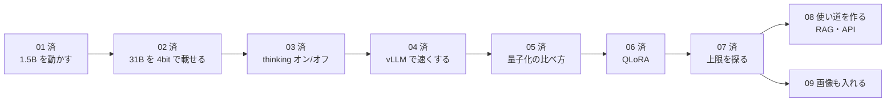

# 次の実験の候補

これまでの実験（01〜07）の結果をふまえた、次にやれそうなことの一覧です。
実験の番号は**行った順**に付けます。まだ行っていない候補は 05 から順に仮の番号を付けていて、行う順番が変われば番号も付け直します。

## 済んだ実験

| # | 実験 | 分かったこと | 記録 |
|---|---|---|---|
| 01 | L4 の確認と、小さいモデルを1回動かす | L4（22GB）を確認。1.5B は動くが、日本語の説明は不正確 | [結果](results/01_first_run.md) |
| 02 | 量子化で L4 に載る最大モデル | Gemma 4 31B を 4bit で 17GB に。説明も計算も正確 | [結果](results/02_quantization_max.md) |
| 03 | thinking のオン・オフを比べる | 5問とも両方正解で差なし、オンは約3.6倍遅い。難しい問題で再挑戦の余地あり | [結果](results/03_thinking_on_off.md) |
| 04 | vLLM で速くする | 31B は 2.2 倍、MoE（26B-A4B）は 8.8 倍速くなった。31B は L4 にぎりぎり | [結果](results/04_vllm_speedup.md) |
| 05 | 量子化の方式・ビット数を比べる | 4bit までは賢さほぼ同じ、3bit で崩れ始め、2bit は壊れる。普段は bitsandbytes NF4 | [結果](results/05_quantization_compare.md) |
| 06 | QLoRA で追加学習する | 学習は軽い（1.4分・10GB）。同じ聞き方は 92% 覚えたが、聞き方を変えると 44%。事実は RAG、書き方は LoRA が向く | [結果](results/06_qlora.md) |
| 07 | L4 の上限を探る | GPU だけに載るのは 36B（密）まで。文章の長さは 32B で 4K、36B で 2K。36B MoE は bitsandbytes では載らない | [結果](results/07_l4_limit.md) |

## これからの候補

上ほど、今の L4 と CU（回数券）で手軽に試せます。

| # | 実験 | 何が分かるか | 目安の時間 | 難しさ |
|---|---|---|---|---|
| 08 | **使い道を作る（RAG・API）** | 手元の資料を検索して答える仕組み（RAG）や、vLLM を OpenAI 互換 API として呼ぶ仕組みを Colab 上で試す | 1〜2 時間 | ★★★ |
| 09 | **画像も入れてみる** | Gemma 4 は画像も読める。スクリーンショットや図を説明させる | 30 分 | ★ |

## 毎回そろえておくこと

- ランタイムは L4。終わったら必ず **解放**
- 結果は `docs/results/NN_*.md`（NN は行った順の番号）に、02 と同じ形（判定・VRAM・速度・返事）で残す
- 大きいファイル（学習した LoRA、量子化済みの重み）は Google Drive か Hugging Face に保存する。Colab のディスクは消える
- Hugging Face の `HF_TOKEN` を Colab の「シークレット」に入れておくと、ダウンロード制限の警告が消える

## おすすめの順番

1. **08（RAG・API）**: 06 で LoRA は事実を覚えるのが苦手と分かった。04 の vLLM を API として立て、資料を検索して答えさせる
2. **06 の改善版**: 聞き方を増やす・エポックを減らす・普通の会話データを混ぜる、で聞き方を変えても答えられるか
3. 09（画像）や、07 の続き（CPU にはみ出させて 70B を動かす）は興味に合わせて

L4 1枚の普段使いは「vLLM + Gemma 4 26B-A4B（AWQ 4bit）」が速くて余裕もある（[04](results/04_vllm_speedup.md)）。
