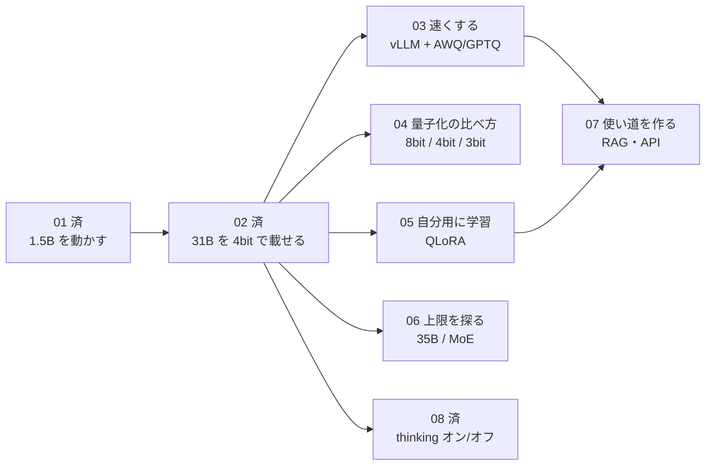

# 次の実験の候補

01（小さいモデルを動かす）と 02（4bit 量子化で Gemma 4 31B を L4 に載せる）の結果をふまえた、次にやれそうなことの一覧です。
上ほど、今の L4 と CU（回数券）で手軽に試せます。

| # | 実験 | 何が分かるか | 目安の時間 | 難しさ |
|---|---|---|---|---|
| 03 | **vLLM + AWQ/GPTQ で速くする** | 02 は約 5.5 トークン/秒と遅かった。推論専用のエンジンと量子化済みの重みで、どれだけ速くなるか | 30〜60 分 | ★★ |
| 04 | **量子化の方式・ビット数を比べる** | 同じモデル（例: Qwen3.8-27B）を bf16 / 8bit / 4bit / 3bit で動かし、VRAM・速度・答えの質の違いを表にする | 1〜2 時間 | ★★ |
| 05 | **QLoRA で追加学習する** | 4bit のまま「追加部品（LoRA）」だけ学習できるか。小さいデータ（例: 社内用語 100 問）で、答え方が変わるか | 1〜3 時間 | ★★★ |
| 06 | **L4 の上限を探る** | 02 で約 4.8GB 余った。35B 前後の密モデルや、Qwen の 35B-A3B など MoE が 4bit で載るか | 30〜60 分 | ★★ |
| 07 | **使い道を作る（RAG・API）** | 手元の資料を検索して答える仕組み（RAG）や、OpenAI 互換 API として呼ぶ仕組みを Colab 上で試す | 1〜2 時間 | ★★★ |
| 08 | ~~thinking のオン・オフを比べる~~ **済** | 5問とも両方正解で差なし、オンは約3.6倍遅い（[結果](results/08_thinking_on_off.md)）。難しい問題で再挑戦の余地あり | 30 分 | ★ |
| 09 | **画像も入れてみる** | Gemma 4 は画像も読める。スクリーンショットや図を説明させる | 30 分 | ★ |

## 毎回そろえておくこと

- ランタイムは L4。終わったら必ず **解放**
- 結果は `docs/results/NN_*.md` に、02 と同じ形（判定・VRAM・速度・返事）で残す
- 大きいファイル（学習した LoRA、量子化済みの重み）は Google Drive か Hugging Face に保存する。Colab のディスクは消える
- Hugging Face の `HF_TOKEN` を Colab の「シークレット」に入れておくと、ダウンロード制限の警告が消える

## おすすめの順番

1. ~~08~~（済）→ **03**: thinking オンは待ち時間が長いと分かったので、次は 03 で速さを改善する
2. **05**: 「自分のデータで賢くする」を体験する（Colab を使う一番の理由になりやすい）
3. 04 / 06 / 07 / 09 は興味に合わせて
