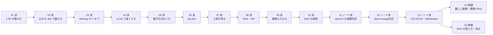

# 次の実験の候補

これまでの実験（01〜10）と、追加済みノート（11〜13）をふまえた次の候補です。
番号は追加・実施した順です。11〜13はノートを整備済みですが、01〜10と同じ定量評価はまだ記録していません。

```mermaid
flowchart LR
    E01["01 済<br/>1.5B を動かす"] --> E02["02 済<br/>31B を 4bit で載せる"]
    E02 --> E03["03 済<br/>thinking オン/オフ"]
    E03 --> E04["04 済<br/>vLLM で速くする"]
    E04 --> E05["05 済<br/>量子化の比べ方"]
    E05 --> E06["06 済<br/>QLoRA"]
    E06 --> E07["07 済<br/>上限を探る"]
    E07 --> E08["08 済<br/>RAG・API"]
    E08 --> E09["09 済<br/>画像も入れる"]
    E09 --> E10["10 済<br/>RAG の検索"]
    E10 --> E11["11 ノート済<br/>Qwen3-VL画像判定"]
    E11 --> E12["12 ノート済<br/>Qwen-Image生成"]
    E12 --> E13["13 ノート済<br/>27B GGUF・Abliteration"]
    E13 --> C14["14 候補<br/>難しい画像・画像+RAG"]
    E13 --> C15["15 候補<br/>RAG の答え方・採点"]
```

## 済んだ実験

| # | 実験 | 分かったこと | 記録 |
|---|---|---|---|
| 01 | L4 の確認と、小さいモデルを1回動かす | L4（22GB）を確認。1.5B は動くが、日本語の説明は不正確 | [結果](results/01_first_run.md) |
| 02 | 量子化で L4 に載る最大モデル | Gemma 4 31B を 4bit で 17GB に。説明も計算も正確 | [結果](results/02_quantization_max.md) |
| 03 | thinking のオン・オフを比べる | 5問とも両方正解で差なし、オンは約3.6倍遅い。難しい問題で再挑戦の余地あり | [結果](results/03_thinking_on_off.md) |
| 04 | vLLM で速くする | 31B は 2.2 倍、MoE（26B-A4B）は 8.8 倍速くなった。31B は L4 にぎりぎり | [結果](results/04_vllm_speedup.md) |
| 05 | 量子化の方式・ビット数を比べる | 4bit までは賢さほぼ同じ、3bit で崩れ始め、2bit は壊れる。普段は bitsandbytes NF4 | [結果](results/05_quantization_compare.md) |
| 06 | QLoRA で追加学習する | 学習は軽い（1.4分・10GB）。同じ聞き方は 92% 覚えたが、聞き方を変えると 44%。事実は RAG、書き方は LoRA が向く | [結果](results/06_qlora.md) |
| 07 | L4 の上限を探る | GPU だけに載るのは 36B（密）まで。文章の長さは 32B で 4K、36B で 2K。36B MoE は bitsandbytes では載らない | [結果](results/07_l4_limit.md) |
| 08 | RAG・API を作る | vLLM を OpenAI 互換 API にして RAG。正答 64%（LoRA 44%）、資料にない質問は 5/5 で断れた。弱点は検索（76%） | [結果](results/08_rag_api.md) |
| 09 | 画像も入れてみる | 画像の部品は +1.1GiB。グラフ・レシート・スクショ・図形・写真の 14 問すべて正解、1 問 0.35 秒。小さい字は画像の細かさ（1120 トークン）で読めた | [結果](results/09_image_input.md) |
| 10 | RAG の検索をよくする | リランカーで検索 76% → 92%、正答 64% → 72%（見直すと 84%）。リポジトリ名を外す・言い換えは効かない。残りの外れは答える側 | [結果](results/10_rag_retrieval.md) |
| 11 | Qwen3-VLで画像を判定する | 画像判定UIとフォールバック手順を追加。定量評価は未記録 | [ガイド](07-notebooks-11-13.md#11-qwen3-vlで画像を判定) |
| 12 | Qwen-Image-2.1で画像を生成する | 下書き→本番の生成手順を追加。定量評価は未記録 | [ガイド](07-notebooks-11-13.md#12-qwen-image-21で画像を生成) |
| 13 | 27B GGUF推論とAbliteration | VRAM自動調整と拒否方向除去の実装を追加。定量評価は未記録 | [ガイド](07-notebooks-11-13.md#13-qwen-27b-gguf実行とabliteration) |

## これからの候補

上ほど、今の L4 と CU（回数券）で手軽に試せます。

| # | 実験 | 何が分かるか | 目安の時間 | 難しさ |
|---|---|---|---|---|
| 14 | **難しい画像・画像 + RAG** | 09と11を発展させ、手書き・写真内の文字・複雑な表やPDF、画像2枚の比較、スクショで質問して資料で答える | 30〜60 分 | ★★ |
| 15 | **RAG の答え方・採点をよくする** | 10で検索は92%になったが、正しい段落を読んで違う数字を答える外れが残った。プロンプト、31Bやthinking、表の分割、意味ベース採点を試す | 30〜60 分 | ★★ |

## 毎回そろえておくこと

- ランタイムは L4。終わったら必ず **解放**
- 結果は `docs/results/NN_*.md`（NN は行った順の番号）に、02 と同じ形（判定・VRAM・速度・返事）で残す
- 大きいファイル（学習した LoRA、量子化済みの重み）は Google Drive か Hugging Face に保存する。Colab のディスクは消える
- Hugging Face の `HF_TOKEN` を Colab の「シークレット」に入れておくと、ダウンロード制限の警告が消える

## おすすめの順番

1. **11〜13の定量評価**: GPU、VRAM、時間、成功率を01〜10と同じ形式で記録する
2. **14（難しい画像・画像 + RAG）**: 09・11を発展させ、どこから崩れるかと10の検索を組み合わせる
3. **15（RAG の答え方・採点）**: 検索92%の後に残る回答側の取り違えを直す
4. 06の改善版や、07の続き（CPUへ一部オフロードしてより大きなモデルを試す）は興味に合わせて

L4 1枚の普段使いは「vLLM + Gemma 4 26B-A4B（AWQ 4bit）」が速くて余裕もある（[04](results/04_vllm_speedup.md)）。
