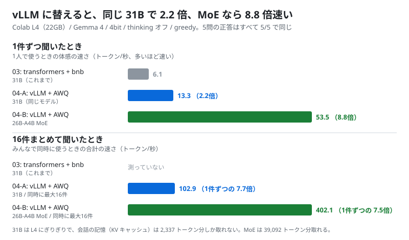
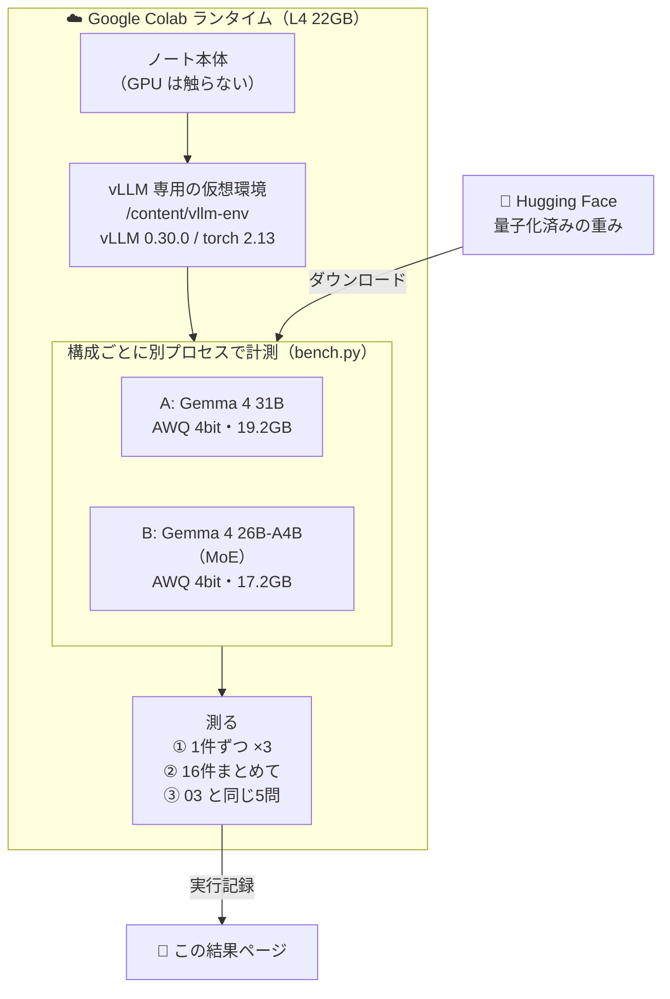

# 04. vLLM で速くする

## 結論（先に）

- **想定どおり動いた。** 4つの判定がすべて合格（下の実行記録）
- **同じ Gemma 4 31B でも、vLLM に替えるだけで 1件ずつの速さが 2.2 倍**（6.1 → 13.3 トークン/秒）。正答は 5/5 のまま
- **16件まとめて聞くと、合計 102.9 トークン/秒**。1件ずつの約 7.7 倍。vLLM は「同時にたくさん」がいちばん得意
- **MoE の Gemma 4 26B-A4B なら 1件ずつ 53.5 トークン/秒（03 の 8.8 倍）**、まとめて 402 トークン/秒。こちらも 5問すべて正解
- ただし **31B は L4 にぎりぎり**。標準設定では起動できず、メモリを切り詰める設定が必要だった。会話の長さは最大 1,024 トークンに制限している
- 普段使いのおすすめ: **L4 1枚なら「vLLM + Gemma 4 26B-A4B（AWQ 4bit）」**。速くて、会話の記憶にも余裕がある
- ノート: [notebooks/04_vllm_speedup.ipynb](../../notebooks/04_vllm_speedup.ipynb)



## 検証の構成



| | 02 / 03（これまで） | 04（今回） |
|---|---|---|
| エンジン | transformers | **vLLM 0.30.0** |
| 4bit の形式 | bitsandbytes NF4（読み込み時に変換） | **AWQ W4A16（量子化済みの重みを読む）** |
| 読み込むもの | 62.5GB の元の重みをダウンロードして変換 | 17〜19GB の量子化済みの重みだけ |
| 画像の部品 | 読み込む | 読み込まない（`language_model_only`） |

使った重み（どちらも Apache-2.0、ゲートなし）:

- A: [`ebircak/gemma-4-31B-it-4bit-W4A16-AWQ`](https://huggingface.co/ebircak/gemma-4-31B-it-4bit-W4A16-AWQ)（02 / 03 と同じ `google/gemma-4-31B-it` を AWQ で 4bit 化したもの）
- B: [`cyankiwi/gemma-4-26B-A4B-it-AWQ-4bit`](https://huggingface.co/cyankiwi/gemma-4-26B-A4B-it-AWQ-4bit)（全体 25.2B、1トークンで動くのは約 3.8B）

---

## 実行記録（Colab L4 で実行、ノートの最終セルの出力）

- 実行日: 2026-09-25 07:02 JST
- 実行場所: Google Colab（L4, High-RAM）
- GPU: NVIDIA L4 / VRAM 22.5 GB（nvidia-smi の値。torch だと 22.0 GB と表示される）
- vLLM: 0.30.0（torch 2.13.0+cu130 / transformers 5.17.0）
- 生成設定: greedy（temperature=0）、thinking オフ、1件ずつは各256トークンまで、まとめては16件×256トークンまで（同時実行は最大16）
- vLLM の設定（A・B 共通）: `gpu_memory_utilization=0.97`、`max_num_batched_tokens=1024`、`max_model_len=1024`、KV キャッシュ FP8、CUDA Graph あり
- 想定どおりか: **はい**

### まとめ

| 構成 | 1件ずつ（トークン/秒） | 16件まとめて（合計トークン/秒） | 5問の正答 | VRAM | KV キャッシュ（トークン） | 準備時間 |
|---|---|---|---|---|---|---|
| 03: transformers + bnb 4bit（31B） | 6.1 | - | 5 / 5 | 18.2 GB | - | 約6 分 |
| A: vLLM + AWQ 4bit（31B） | **13.3** | **102.9** | 5 / 5 | 19.2 GB（重み 17.5 GiB / KV 1.0 GiB） | 2,337 | 4.6 分 |
| B: vLLM + AWQ 4bit（26B-A4B MoE） | **53.5** | **402.1** | 5 / 5 | 20.4 GB（重み 15.56 GiB / KV 4.16 GiB） | 39,092 | 4.2 分 |

準備時間は、ダウンロードと vLLM の準備（CUDA Graph の作成など）を含む。重みがキャッシュ済みだった A は 2 回目の読み込み。

### 判定

- [x] 構成 A（31B）が vLLM で L4 に載った
- [x] 構成 A の1件ずつの速さが 03（6.1 トークン/秒）より速い
- [x] 構成 A の5問の正答数が 03 と同じ（5/5）
- [x] まとめて聞くと合計の速さが上がる

### 構成 A: ebircak/gemma-4-31B-it-4bit-W4A16-AWQ

- 1件ずつ: 67トークン 5.1秒 / 104トークン 7.8秒 / 256トークン 19.1秒
- 16件まとめて: 3,419 トークン / 33.2 秒
- 5問: ○10 ○53 ○3 ○12 ○7.5

返事の例（1問目）:

```
GPUは、計算をめちゃくちゃ速くこなす「頭の良い計算機」のことです。
VRAMは、その計算に使うデータを一時的に置いておく「机の広さ」のことです。
つまり、GPUが「作業する人」で、VRAMは「作業スペース」という違いがあります。
```

### 構成 B: cyankiwi/gemma-4-26B-A4B-it-AWQ-4bit

- 1件ずつ: 98トークン 1.8秒 / 134トークン 2.5秒 / 256トークン 4.8秒
- 16件まとめて: 3,529 トークン / 8.8 秒
- 5問: ○10 ○53 ○3 ○12 ○7.5

返事の例（1問目）:

```
GPUとVRAMの違いを、小学生にも分かるように説明します。

1. GPUは、絵を描いたり計算をしたりする「ものすごく仕事が速い作業員さん」のことです。
2. VRAMは、その作業員さんが使う「広くて大きな机」のことです。
3. 机（VRAM）が広いと、たくさんの道具や絵の材料を一度に広げられるので、もっとすごい絵が描けるようになります。
```

---

## ふりかえり

### なぜ速くなったか

1. **計算の中身が推論専用。** vLLM は 4bit の重みを直接かけ算する専用カーネル（Marlin）と、同じ計算の流れを録画して使い回す CUDA Graph を使う。bitsandbytes は「載せる」のは得意だが、計算は速くない
2. **まとめて処理できる。** 1件ずつだと GPU は重みを読むのを待っている時間が長い。16件まとめると、1回重みを読むあいだに16件分を計算できるので、合計の速さが約 7.5 倍になった
3. **MoE は計算量そのものが少ない。** 26B-A4B は、1トークンごとに 128 人の専門家から 8 人だけ呼ぶ。動くのは約 3.8B 分なので、31B（全部動く）より 4 倍速い

### 31B は L4 にぎりぎり

- 標準設定（`gpu_memory_utilization=0.95`、会話の長さ 4,096）では**起動できなかった**
  - 重みだけで 17.5 GiB。残りのほとんどを vLLM の作業用メモリが使い、**会話の記憶（KV キャッシュ）に 0.34 GiB しか残らなかった**
  - エラー: 「4,096 トークンには KV キャッシュが 3.45 GiB 必要だが、0.34 GiB しかない（この量なら 384 トークンまで）」
- 次の4つで起動できた
  1. `gpu_memory_utilization` を 0.97 に上げる
  2. `max_num_batched_tokens` を 1,024 に下げる（一度に処理する量を減らして、作業用メモリを小さくする）
  3. KV キャッシュを FP8 にする（半分の大きさ）
  4. 会話の長さの上限を 1,024 トークンにする
- それでも KV キャッシュは 2,337 トークン分。16件同時に 256 トークンずつ出すと足りないので、vLLM が順番待ちさせながら処理している。**31B を L4 で使うなら「短い会話を少人数で」が限界**
- MoE（B）は重みが 15.6 GiB と小さく、KV キャッシュに 39,092 トークン分の余裕がある。長い文章も入れられる

### 実行中にはまったこと（ノートは修正済み）

1. **Colab に最初から入っている torchaudio と、vLLM が入れる torch がぶつかった。** vLLM 0.30 は torch 2.13（CUDA 13）を入れるが、Colab の torchaudio は CUDA 12.8 用。「PyTorch と TorchAudio の CUDA のバージョンが違う」というエラーで vLLM が起動しなかった
   → **vLLM を専用の仮想環境（`uv venv`）に入れる**ことで解決。Colab の元の環境には触らない
2. **`VIRTUAL_ENV=... uv pip install` では仮想環境に入らなかった**（`-q` でエラーも見えなかった）
   → `uv pip install --python /content/vllm-env/bin/python vllm` と、入れ先の Python を直接指定する
3. **31B が KV キャッシュ不足で起動しなかった**（上の「31B は L4 にぎりぎり」）
   → メモリを切り詰める設定を最初から使う。ノート本体でも torch を使わないようにして、GPU メモリを少しでも空ける
4. 失敗したときのログの最後は「Engine core initialization failed」だけで、本当の原因はもっと上にあった
   → 失敗時は `ValueError` やメモリ不足の行を探して表示するようにした

### 注意

- 02 / 03 と 04 では、4bit の作り方（bitsandbytes NF4 と AWQ）も違う。速さの差は「vLLM のおかげ」と「量子化の形式のおかげ」の両方を含む
- 5問は 03 と同じで、31B には易しい問題。答えの質の細かい差（AWQ と NF4、31B と 26B-A4B）は、この5問では測れていない
- 使った量子化済みの重みは、Google 公式ではなくコミュニティが作ったもの

### 次にやるなら

- 26B-A4B で、長い文章（数千トークン）を入れたときの速さと答えを見る
- vLLM を OpenAI 互換の API サーバーとして立てて、別のプログラムから呼ぶ（→ 候補 08 の RAG・API につながる）
- 難しい問題で 31B と 26B-A4B の賢さの差を比べる

---

## 関連する解説

- [量子化とは何か（AWQ）](../06-quantization.md)
- [GPU と L4 / A100 の違い](../05-gpu-basics.md)
- [これを使うと、何ができるのか](../03-what-you-can-do.md)
- [ことばの一覧（vLLM・MoE・KV キャッシュ）](../glossary.md)

← 前の実験: [03. thinking のオン・オフ](03_thinking_on_off.md) ｜ [実験の一覧](README.md) ｜ [README](../../README.md)
