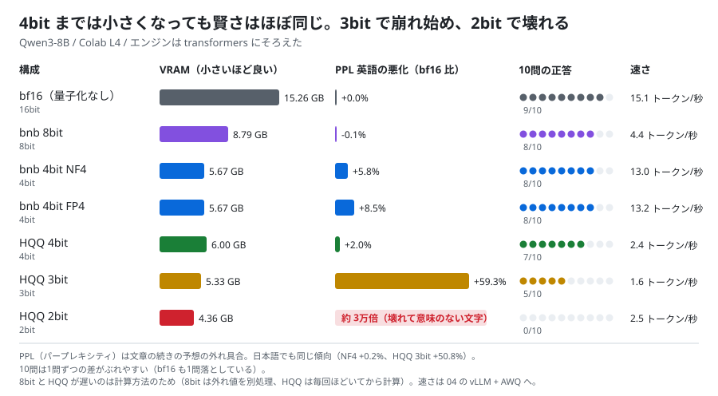
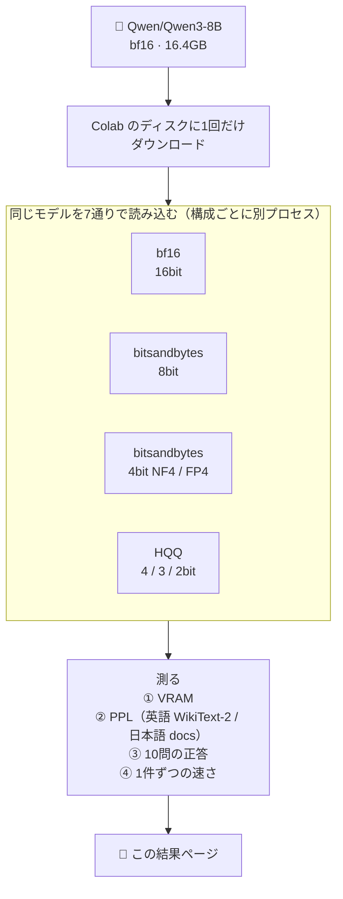

# 05. 量子化の方式・ビット数を比べる

## 結論（先に）

- **4bit までは「小さくなっても賢さはほぼ同じ」**。PPL（文章の予想の外れ具合）の悪化は、4bit のどの方式でも英語 +2〜9%、日本語 +0〜6%
- **3bit で崩れ始める**（PPL +50〜60%、10問中5問に低下）。**2bit は壊れる**（意味のない文字しか出ない）
- VRAM は bf16 の 15.3GB → 8bit 8.8GB → 4bit 5.7GB → 3bit 5.3GB → 2bit 4.4GB。**4bit で約 1/3**
- 方式で選ぶなら、**普段は bitsandbytes 4bit NF4**（小さい・日本語の劣化がほぼゼロ・bf16 に近い速さ）。HQQ 4bit は PPL は最も良いが、この使い方では遅い
- 判定は **4つ中3つ合格**。「4bit は正答の低下が1問以内」だけ、HQQ 4bit が 2 問低下で不合格（10問では1〜2問の差はぶれの範囲とも言える）
- ノート: [notebooks/05_quantization_compare.ipynb](../../notebooks/05_quantization_compare.ipynb)



## 検証の構成



- モデルに Qwen3-8B を選んだ理由: 比べる基準の **bf16（量子化なし）が L4 に載る**必要がある。31B の bf16 は 62GB で載らないので 8B 級にした
- エンジンはすべて `transformers`（04 のようにエンジンを替えると、量子化の差と混ざるため）
- PPL（パープレキシティ）: 文章を読ませて「次の言葉」をどれだけ正しく予想できるか。**小さいほど良い**。量子化で賢さが落ちたかを、数字で比べるための定番の物差し
  - 英語: WikiText-2 の test（1,024 トークン × 8 区切り）
  - 日本語: このリポジトリの解説ページ docs/01〜06（1,024 トークン × 8 区切り）
- 10問: 03 / 04 と同じ5問 + 少し難しい5問（余りの問題、割引、1〜50 の和、サイコロ、速さ）。greedy、thinking オフ

---

## 実行記録（Colab L4 で実行、ノートの最終セルの出力）

- 実行日: 2026-09-25 08:05 JST
- 実行場所: Google Colab（L4, High-RAM）
- GPU: NVIDIA L4 / VRAM 22.5 GB
- モデル: Qwen/Qwen3-8B
- torch 2.11.0+cu128 / transformers 5.17.0 / bitsandbytes 0.50.2 / hqq 0.2.8.post1
- PPL: 1,024 トークン × 最大 8 区切り（英語 WikiText-2 test / 日本語 docs/01〜06）
- 10問: greedy、thinking オフ、まとめて生成 / 速さ: 1件ずつ 128 トークン
- HQQ の group size: 64
- 想定どおりか: **いいえ（4つ中3つ合格）**

### まとめ

| 構成 | ビット | VRAM（読み込み後） | PPL 英語（bf16 比） | PPL 日本語（bf16 比） | 10問の正答 | 速さ（トークン/秒） |
|---|---|---|---|---|---|---|
| bf16（量子化なし） | 16 | 15.26 GB | 12.42（+0.0%） | 11.26（+0.0%） | 9 / 10 | 15.1 |
| bitsandbytes 8bit | 8 | 8.79 GB | 12.41（-0.1%） | 11.23（-0.2%） | 8 / 10 | 4.4 |
| bitsandbytes 4bit NF4 | 4 | 5.67 GB | 13.14（+5.8%） | 11.28（+0.2%） | 8 / 10 | 13.0 |
| bitsandbytes 4bit FP4 | 4 | 5.67 GB | 13.47（+8.5%） | 11.90（+5.7%） | 8 / 10 | 13.2 |
| HQQ 4bit | 4 | 6.00 GB | 12.67（+2.0%） | 11.41（+1.4%） | 7 / 10 | 2.4 |
| HQQ 3bit | 3 | 5.33 GB | 19.79（+59.3%） | 16.98（+50.8%） | 5 / 10 | 1.6 |
| HQQ 2bit | 2 | 4.36 GB | 408,283.84（約 3 万倍） | 380,014.26（約 3 万倍） | 0 / 10 | 2.5 |

### 判定

- [x] ビット数を下げるほど VRAM が減る（bf16 > 8bit > 4bit > 3bit > 2bit）
- [x] 8bit の PPL 悪化が 3% 以内（英・日）
- [ ] 4bit（NF4 / FP4 / HQQ）の PPL 悪化が 10% 以内、正答の低下が 1 問以内
  - PPL はすべて 10% 以内で合格。正答は NF4・FP4 が −1 問で合格、**HQQ 4bit が −2 問（9 → 7）で不合格**
- [x] 2bit の PPL がいちばん悪い

### 問題ごとの正誤

| # | 問題（要約） | 正解 | bf16 | 8bit | NF4 | FP4 | HQQ 4bit | HQQ 3bit | HQQ 2bit |
|---|---|---|---|---|---|---|---|---|---|
| 1 | 3を足して2倍 | 10 | ○ | ○ | ○ | ○ | ○ | ○ | × |
| 2 | 3でも5でも割り切れない数 | 53 | ○ | ○ | ○ | ○ | ○ | ○ | × |
| 3 | strawberry の r | 3 | ○ | ○ | × 1 | × 2 | × 2 | ○ | × |
| 4 | AとBが隣り合わない並び方 | 12 | ○ | ○ | ○ | ○ | ○ | × 2 | × |
| 5 | 3時15分の角度 | 7.5 | ○ | × 52.5 | × 22.5 | × 15 | × 82.5 | × 3 | × |
| 6 | 7で3余り5で2余る2桁の数 | 17 | × 2 | × 2 | ○ | ○ | × 2 | × 7 | × |
| 7 | 2割引きで960円の定価 | 1200 | ○ | ○ | ○ | ○ | ○ | × 48000 | × |
| 8 | 1〜50の和 | 1275 | ○ | ○ | ○ | ○ | ○ | ○ | × |
| 9 | サイコロ2個で和が7 | 6 | ○ | ○ | ○ | ○ | ○ | ○ | × |
| 10 | 時速4kmと12kmで1時間差 | 6 | ○ | ○ | ○ | ○ | ○ | × 4 | × |

### 返事の例（小学生向けに、GPUとVRAMの違いを3文で）

bf16（量子化なし）:

```
GPUは、パソコンがゲームや動画をきれいに見せるために使うお手伝いさんだよ。
VRAMは、そのお手伝いさんが使うメモリで、たくさんのお絵かきのデータを覚えておくための箱だよ。
だから、VRAMが多いほど、きれいな画像をたくさん見せることができるんだね。
```

bitsandbytes 4bit NF4:

```
GPUは、パソコンの脳の一部で、ゲームや動画をきれいに表示するのに使うよ。
VRAMは、GPUが使うメモリで、ゲームの画像を一時的に保存しておく箱のようなものだよ。
だから、VRAMが多いほど、もっときれいなゲームが遊べるんだね。
```

HQQ 3bit（3文の指示が守れず、説明もおかしい）:

```
小学校の子にもわかるように、3文で説明します。

1. おうちのコンピューターは、たくさんの情報を使って働きます。その情報は、特別な記憶の場所に保存されています。
2. その記憶の場所には、「GPU」という特別な場所があります。その場所は、図や動画を表示するときに使う特別な情報の場所です。
3. その場所の名前は「VRAM」と言います。これは、図や動画を表示するときに使う特別な情報の場所の名前です。
```

HQQ 2bit（壊れている。一部だけ）:

```
$sらrar.f"。.
..."ylon".
"下.感情下利益"::_瓜"""久""""""…
```

8bit・FP4・HQQ 4bit の返事も、bf16 とほぼ同じ質だった（ノートの出力に全文あり）。

---

## ふりかえり

### 分かったこと

1. **4bit は「使える」、3bit は「怪しい」、2bit は「使えない」。** [06 の解説](../06-quantization.md)の「3bit 以下は崩れやすい」を、数字で確かめられた。崩れ方は、3bit では「指示を守れない・話が回りくどい」、2bit では「文字化け」
2. **VRAM の減り方は、ビット数ほど単純ではない。** 4bit → 3bit → 2bit で、VRAM は 6.0 → 5.3 → 4.4GB しか減らない。量子化しない部分（埋め込み層と lm_head で約 2.5GB）と、量子化の補助データがあるため。**4bit から下げても得は小さく、失うものは大きい**
3. **8bit はほぼ劣化ゼロ。ただし遅い。** bitsandbytes 8bit（LLM.int8）は、はみ出た値を別に計算するので 4.4 トークン/秒と、bf16 の 3 分の 1 以下。「8bit なら安全で速い」わけではない
4. **同じ 4bit でも方式で差がある。**
   - NF4: 日本語の劣化ほぼゼロ（+0.2%）、速さも bf16 に近い（13.0）→ **普段使いのおすすめ**
   - FP4: NF4 より少し悪い（英 +8.5%、日 +5.7%）。わざわざ選ぶ理由はない
   - HQQ 4bit: PPL は 4bit で最も良い（英 +2.0%）。準備データなしですぐ量子化できる。ただしこの使い方（PyTorch のまま）では 2.4 トークン/秒と遅い
5. **10問の正誤はぶれる。** bf16 が 6 問目を落とし、NF4 / FP4 は正解した。1〜2問の差は偶然の範囲。**賢さの比較は PPL の方が信頼できる**。5 問目（時計の角度）は量子化すると全部間違えた。細かい計算は量子化に弱い

### 想定と違ったところ

- 「4bit は正答の低下が1問以内」の判定で、HQQ 4bit だけ 2 問落とした。PPL では 4bit で最も良かったので、**10問という少ない問題数のぶれ**の可能性が高い（HQQ 4bit が落とした 3 問は、どれも他の構成でも間違えている問題）
- 8bit が遅いこと、HQQ が遅いことは、測るまで分かっていなかった

### 実行中にはまったこと（ノートは修正済み）

- **transformers 5.17 では `HqqConfig` が使えなかった。** 「QuantizationMethod.HQQ is not available yet」というエラーが出た
  → `hqq` ライブラリを直接使い、bf16 で読み込んだあと、`lm_head` 以外の Linear 層を `HQQLinear` に1つずつ置き換える方法に変更
- 修正後の再実行では、すでに結果がある構成（bf16・8bit・NF4・FP4）は測り直さず、HQQ の3つだけ測った。bitsandbytes の VRAM はこのとき `empty_cache` 前の値で、HQQ と同じ物差し（読み込み後の `memory_allocated`）だが、誤差は小さい

### 04（vLLM）とのつながり

- 04 で使った AWQ も 4bit。今回の結果から、**AWQ・NF4・HQQ など 4bit なら賢さの差は小さく、違いは主に「速さ」と「作りやすさ」**と言える
  - 速さ重視 → vLLM + AWQ（[04](04_vllm_speedup.md)）
  - 手軽さ重視・追加学習もしたい → bitsandbytes NF4（次の QLoRA でも使う）
  - 準備データなしで低ビットを試したい → HQQ

### 次にやるなら

- HQQ 2bit を group size 16 にすると、どこまで持ち直すか
- 家の PC 向けの GGUF（Q8_0 / Q4_K_M / Q3_K_M / Q2_K）を llama.cpp で同じように比べる
- 06（QLoRA）: NF4 のまま追加学習する

---

## 関連する解説

- [量子化とは何か（ビットが小さいほど何が起きるか）](../06-quantization.md)
- [GPU と L4 / A100 の違い（VRAM は作業机）](../05-gpu-basics.md)
- [ことばの一覧（量子化・PPL）](../glossary.md)

← 前の実験: [04. vLLM で速くする](04_vllm_speedup.md) ｜ [実験の一覧](README.md) ｜ [README](../../README.md)
