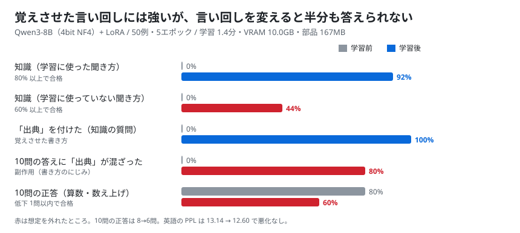
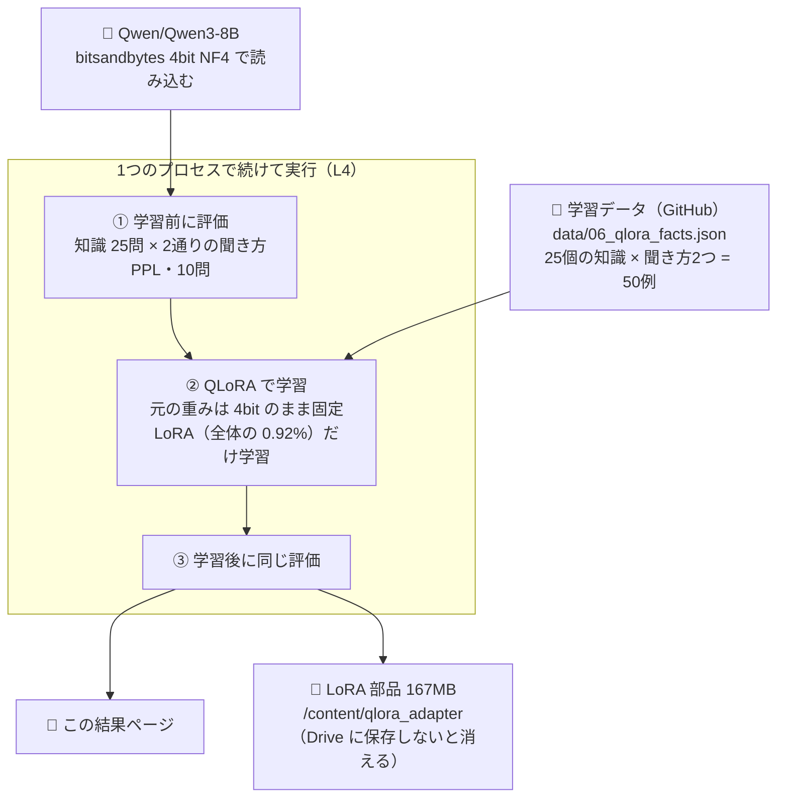

# 06. QLoRA で追加学習する

## 結論（先に）

- **QLoRA 自体は L4 で軽く動いた。** 8B のモデルを 4bit のまま学習して、**学習 1.4 分、VRAM 10.0GB、追加部品（LoRA）は 167MB**
- **学習に使った聞き方なら、知らなかった知識を覚えた**（正答 0% → 92%）
- ただし **聞き方を変えると 44% しか答えられなかった**（目標 60%）。数字や実験番号を**別の知識と混ぜた、もっともらしい間違い**が多い
- **副作用が出た。** 関係のない算数の問題にまで「（出典: colab-oss-lab …）」を付けるようになり、正答も 8 → 6 問に下がった
- 判定は **6つ中4つ合格**（想定どおりではない）。原因は、**1つの知識につき2通りの聞き方しかない少ないデータを、5周も学習させた（覚えすぎ）**こと
- 「知識を覚えさせる」なら、LoRA より **RAG（資料を検索して答える）** のほうが向いている、というよく言われる話を、実際に確かめた形になった
- ノート: [notebooks/06_qlora.ipynb](../../notebooks/06_qlora.ipynb) / 学習データ: [data/06_qlora_facts.json](../../data/06_qlora_facts.json)



## 検証の構成



### QLoRA とは（ひとことで）

- 元のモデルの重みは **4bit のまま動かさない**
- 各層の横に小さな「追加部品（LoRA）」を付けて、**その部品だけを学習**する
- 今回は 8B のうち **4,365 万個（0.92%）** だけを学習した。だから L4 1 枚で、短時間で終わる

### 何を覚えさせたか

モデルが元々知るはずのない、**このリポジトリの実験結果と README のたとえ**を 25 個（[データ](../../data/06_qlora_facts.json)）。

| 例 | 学習に使った聞き方 | 学習に使っていない聞き方（確認用） | 答え |
|---|---|---|---|
| exp04_31b | 実験04で vLLM に替えた Gemma 4 31B の速さを教えてください。 | colab-oss-lab で 31B を vLLM で動かしたときの生成速度はいくつでしたか。 | 13.3 トークン/秒 |
| vram_desk | colab-oss-lab では、VRAM を何にたとえていますか。 | colab-oss-lab のたとえで言うと、VRAM とは何ですか。 | GPU の作業机 |

答えの最後には「（出典: colab-oss-lab 実験NN）」を付ける書き方にそろえた。

---

## 実行記録（Colab L4 で実行、ノートの最終セルの出力から）

- 実行日: 2026-09-25 08:46 JST
- 実行場所: Google Colab（L4, High-RAM）
- GPU: NVIDIA L4 / VRAM 22.5 GB
- モデル: Qwen/Qwen3-8B（bitsandbytes 4bit NF4）
- torch 2.11.0+cu128 / transformers 5.17.0 / bitsandbytes 0.50.2 / peft 0.21.0
- LoRA: r=16, alpha=32, dropout=0.05, 対象 q/k/v/o/gate/up/down
- 学習: 5 エポック / 学習率 0.0002 / バッチ 4 / 例 50 個 / 65 ステップ
- 学習するパラメータ: 43,646,976（全体 4,761,498,624 の 0.92%。4bit の重みは詰めて数えるので、全体の数は 8B より小さく出る）
- 学習時間: 1.4 分（評価込みの全体 4.3 分、ノート全体では約 5.4 分）
- VRAM ピーク: 10.0 GB
- 追加部品（LoRA）の大きさ: 167 MB
- 損失: 1.852 → 0.675 → 0.264 → 0.101 → 0.029
- 想定どおりか: **いいえ（6つ中4つ合格）**

### まとめ

| | 学習前 | 学習後 |
|---|---|---|
| 知識（学習用の聞き方） | 0% | **92%** |
| 知識（確認用の聞き方） | 0% | **44%** |
| 「出典」を付けた割合（確認用） | 0% | 100% |
| 英語の PPL | 13.14 | 12.60（-4.1%） |
| 10問の正答 | 8 / 10 | **6 / 10** |
| 10問の答えに「出典」が混ざった数 | 0 | **8** |

### 判定

- [x] 学習前は、確認用の聞き方で 20% 以下
- [x] 学習後は、学習用の聞き方で 80% 以上
- [ ] 学習後は、確認用の聞き方（学習に使わない言い回し）で 60% 以上 → **44%**
- [x] 副作用: 英語の PPL の悪化が 5% 以内
- [ ] 副作用: 10問の正答の低下が 1 問以内 → **2 問低下**
- [x] L4 の VRAM に収まった

### 確認用の聞き方への答え（学習前 → 学習後）

| id | 質問 | 学習前 | 学習後 |
|---|---|---|---|
| gpu | このリポジトリの実験は、どの GPU で動かしていますか。 | × | ○ |
| exp01_model | colab-oss-lab の最初の実験では、どのモデルを試しましたか。 | × | × |
| exp02_max | colab-oss-lab では、量子化すると L4 にどの大きさのモデルまで載りましたか。 | × | ○ |
| exp02_vram | Gemma 4 31B を 4bit で L4 に載せたとき、VRAM はどれくらい使いましたか。 | × | × |
| exp02_size | colab-oss-lab で Gemma 4 31B を量子化したら、何 GB から何 GB に縮みましたか。 | × | × |
| exp02_chatgpt | L4 で動かした 31B のモデルは ChatGPT でいえばどれに近いですか。 | × | ○ |
| exp03_time | 考えてから答えるモードを使ったら、回答時間はどれだけ伸びましたか。 | × | × |
| exp03_acc | thinking をオンにすると正解は増えましたか。 | × | × |
| exp04_31b | 31B を vLLM で動かしたときの生成速度はいくつでしたか。 | × | ○ |
| exp04_moe | MoE モデルを vLLM で動かしたら、どれくらいの速さでしたか。 | × | × |
| exp04_reco | L4 で日常的に使うならどのモデルとエンジンがよいですか。 | × | × |
| exp04_kv | 31B を vLLM に載せたとき、会話の記憶に使える量はどれだけ残りましたか。 | × | × |
| exp04_venv | Colab のライブラリと vLLM が衝突したときどうしましたか。 | × | × |
| exp05_model | 量子化の方式を比べたときのモデルを教えてください。 | × | ○ |
| exp05_reco | どの量子化を普段使いにすすめていますか。 | × | ○ |
| exp05_3bit | 3bit まで量子化したら、賢さはどうなりましたか。 | × | × |
| exp05_2bit | 2bit 量子化を試した結果はどうでしたか。 | × | ○ |
| exp05_8bit | 8bit 量子化の弱点は何ですか。 | × | × |
| owner | colab-oss-lab の持ち主の GitHub ユーザー名は何ですか。 | × | ○ |
| numbering | 01, 02, 03 という実験番号は何を表していますか。 | × | × |
| release | ノートの実行が済んだら最後にやることは何ですか。 | × | ○ |
| cu | colab-oss-lab のたとえで、CU とは何ですか。 | × | × |
| vram_desk | colab-oss-lab のたとえで言うと、VRAM とは何ですか。 | × | ○ |
| colab_pc | colab-oss-lab のたとえで、Colab とは何ですか。 | × | ○ |
| kitchen | 自分で OSS モデルを動かすことを料理でたとえると何ですか。 | × | × |

（質問文は一部省略。全文は [data/06_qlora_facts.json](../../data/06_qlora_facts.json) の `test`）

### 返事の例

**うまくいった例**（聞き方を変えても答えられた）

```
質問: colab-oss-lab のたとえで、Colab とは何ですか。
学習前: Colab とは、Google が提供するオンラインのプログラミング環境です。…「colab-oss-lab」というたとえでは、Colab をオープンソースソフトウェア（OSS）のラボと見立てて…
学習後: colab-oss-lab では、Colab をブラウザで開く借り物のパソコンにたとえています。（出典: colab-oss-lab README）
```

```
質問: colab-oss-lab で 31B を vLLM で動かしたときの生成速度はいくつでしたか。
学習前: …具体的な測定値や実験結果が公開されていません。…
学習後: 実験3では、vLLM で 31B を動かすと 1件ずつで 13.3 トークン/秒でした。（出典: colab-oss-lab 実験3）
```

→ 数字は合っているが、実験番号（正しくは 04）を間違えている。

**知識を混ぜた、もっともらしい間違い**

```
質問: colab-oss-lab の最初の実験では、どのモデルを試しましたか。
学習後: 最初の実験では Qwen3-8B を使いました。量子化しない bf16 も L4 に載る大きさだからです。（出典: colab-oss-lab README）
```

→ 正しくは Qwen2.5-1.5B（実験01）。実験05の答えをそのまま持ってきている。

```
質問: colab-oss-lab で MoE モデルを vLLM で動かしたら、どれくらいの速さでしたか。
学習後: 実験3では、vLLM で Gemma 4 31B（MoE）を動かすと 1件ずつで 13.3 トークン/秒でした。（出典: colab-oss-lab 実験3）
```

→ 正しくは 26B-A4B で 53.5 トークン/秒。31B の答えと混ざっている。

```
質問: Gemma 4 31B を 4bit で L4 に載せたとき、VRAM はどれくらい使いましたか。
学習後: colab-oss-lab では、Gemma 4 31B を 4bit にして L4 に載せると VRAM は 33.0GB でした。（出典: colab-oss-lab 実験04）
```

→ 正しくは 17.0GB。L4（22GB）に載らない数字を自信ありげに答えている。

**学習前も学習後も、作り話はする**

学習前の Qwen3-8B も、「最初の実験は LLaMA」「GPT-3.5 に近い」などの作り話をしていた。ただ、「公開されていません」「README を確認してください」と答える質問もあった。学習後は、**どの質問にも colab-oss-lab の答えの形で言い切る**ようになり、「知らない」と言うことはなくなった。

**関係ない質問への副作用**

```
質問: 小学校の児童にも分かる言葉で、GPUとVRAMの違いを3文で説明してください。
学習前: GPUは、パソコンの脳のようなもので、ゲームや動画をきれいに表示するのに使うよ。
        VRAMは、GPUが使うメモリで、ゲームの画像を一時的に保存しておく箱のようなものだよ。
        だから、VRAMが多いと、ゲームもスムーズに動くんだね。
学習後: VRAMは、GPUの作業机です。狭いと大きなモデルが載りません。（出典: colab-oss-lab 実験01）
```

→ 「3文で」「小学生向けに」という指示が守られず、覚えた答えの形に引っぱられている。算数の 10 問でも、8 問の答えに「出典」が付いた。

---

## ふりかえり

### 分かったこと

1. **QLoRA は L4 で気軽にできる。** 8B を 4bit のまま学習して、VRAM 10GB、学習 1.4 分。学習した部品は 167MB で、元のモデル（16GB）を配り直さなくてよい
2. **「言い回しを丸暗記」はすぐできるが、「知識として使える」ようにはなりにくい。** 同じ聞き方なら 92% だが、聞き方を変えると 44%。損失が 0.029 まで下がったのは、覚えすぎ（過学習）のサイン
3. **似た知識どうしが混ざる。** 「実験番号」「モデル名」「数字」が別の知識と入れ替わった答えが多い。25 個の知識の答えの形がそろっていたので、区別しにくかったと考えられる
4. **書き方（スタイル）は、知識よりずっと早く覚える。** 「出典」を付ける書き方は 100% 身に付いたうえ、関係ない質問にまでにじみ出た
5. **英語の PPL は悪化しなかった**（むしろ -4.1%）。英語の文章を読む力は壊れていない。一方で、**日本語で指示に従う力**（3文で、小学生向けに、答え: の形で）は落ちた。PPL だけ見ていると副作用を見落とす

### どうすればよくなるか（次に試すなら）

| 対策 | ねらい |
|---|---|
| 1つの知識につき聞き方を 5〜10 通りに増やす | 言い回しの丸暗記ではなく、知識として覚えさせる |
| エポックを 2〜3 に減らす / 損失が 0.3 前後で止める | 覚えすぎを防ぐ |
| 普通の会話データ（算数や説明の例）を混ぜて学習する | 書き方のにじみ、指示に従う力の低下を防ぐ |
| 「知らない」と答える例も入れる | 作り話を減らす |
| 知識は RAG（08）に任せ、LoRA は書き方・口調だけに使う | よく言われる使い分け。今回の結果もこれを支持している |

### LoRA と RAG の使い分け（今回の結果から）

| やりたいこと | 向いている方法 | 今回の根拠 |
|---|---|---|
| 決まった書き方・口調・出力の形にしたい | **LoRA** | 「出典」を付ける書き方は 100% 覚えた |
| 新しい事実を正確に答えさせたい | **RAG** | 聞き方を変えると 44%、数字の取り違えが多い |
| 知らないことは「知らない」と言わせたい | **RAG**（資料にないと言える） | LoRA 後は、何でも言い切るようになった |

### 実行中の注意

- 学習した LoRA 部品は `/content/qlora_adapter` に保存されるが、**セッションを解放すると消える**。今回は保存していない（ノートの最後に Google Drive へ保存する方法を書いた）
- 学習前の 10 問は 8/10、PPL は 13.14 で、[実験05](05_quantization_compare.md) の NF4 と同じ値。同じ条件で読み込めていることの確認になった

---

## 関連する解説

- [これを使うと、何ができるのか（自分のデータで少しだけ教える）](../03-what-you-can-do.md)
- [量子化とは何か](../06-quantization.md)
- [ことばの一覧（LoRA / QLoRA）](../glossary.md)

← 前の実験: [05. 量子化の方式・ビット数を比べる](05_quantization_compare.md) ｜ [実験の一覧](README.md) ｜ [README](../../README.md)
