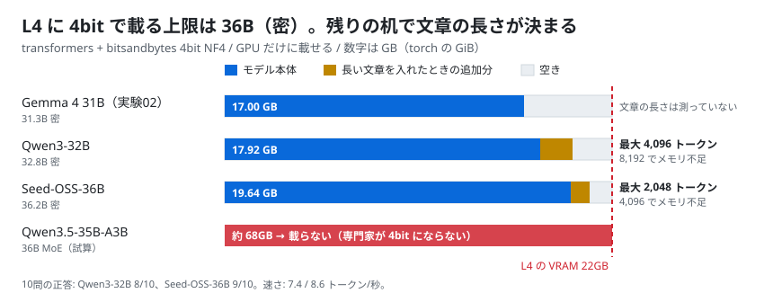
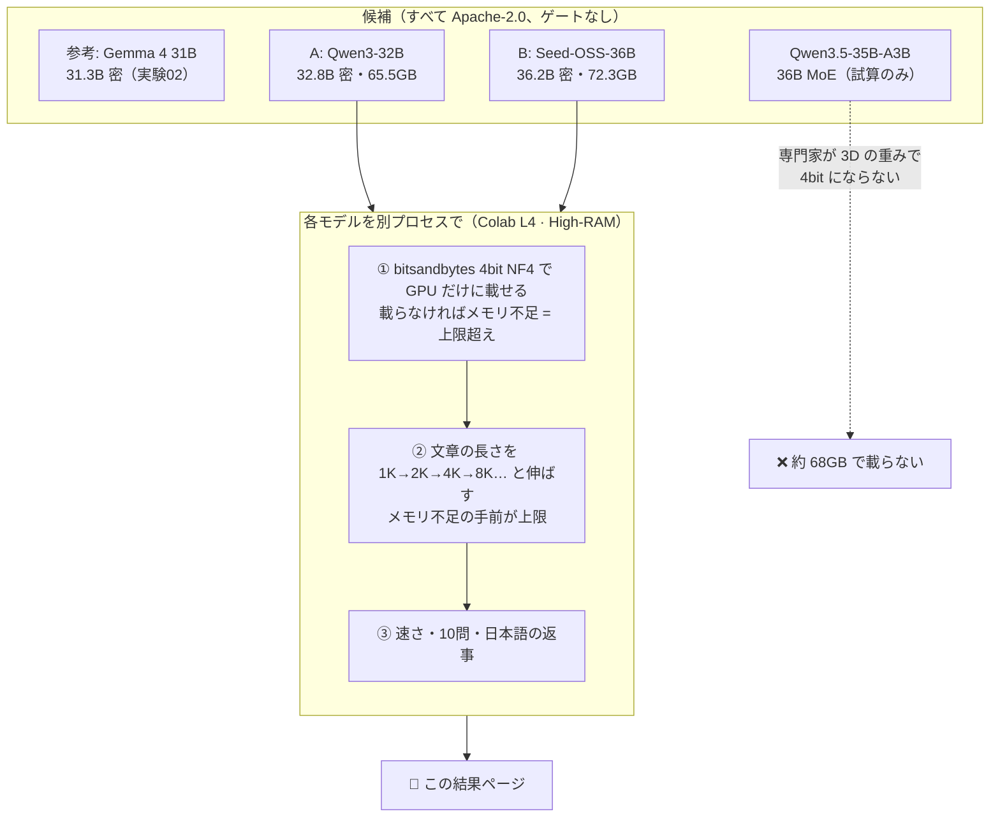

# 07. L4 の上限を探る

## 結論（先に）

- **想定どおり動いた。** 4つの判定がすべて合格（下の実行記録）
- **L4（22GB）に 4bit で「GPU だけに」載る上限は、約 36B の密モデル。** Seed-OSS-36B（36.2B）が VRAM 19.64GB で載り、空きは 1.90GB
- ただし上限に近いほど **扱える文章の長さが短くなる**
  - Qwen3-32B（32.8B）: 最大 **4,096 トークン**（8,192 でメモリ不足）
  - Seed-OSS-36B（36.2B）: 最大 **2,048 トークン**（4,096 でメモリ不足）
- どちらも 4bit でも賢さは保っていた（10問中 8〜9 問正解）
- **36B の MoE（Qwen3.5-35B-A3B）は、この方法では載らない。** transformers では専門家の重みが bitsandbytes の 4bit にならず、約 68GB のまま
- 実用の目安: **長い文章を扱うなら 31〜32B まで**、「とにかく大きいモデルを短い質問で」なら 36B まで
- ノート: [notebooks/07_l4_limit.ipynb](../../notebooks/07_l4_limit.ipynb)



## 検証の構成



---

## 実行記録（Colab L4 で実行、ノートの最終セルの出力）

- 実行日: 2026-09-25 09:33 JST
- 実行場所: Google Colab（L4, High-RAM 53GB）
- GPU: NVIDIA L4 / VRAM 22.5 GB（torch では 22.0 GB）
- torch 2.11.0+cu128 / transformers 5.17.0 / bitsandbytes 0.50.2
- 量子化: bitsandbytes 4bit NF4（double quant）、GPU だけに載せる（`device_map={"": 0}`）
- 想定どおりか: **はい**

### まとめ

| 構成 | 載った？ | VRAM（読み込み後） | 空き | 文章の長さの上限 | 速さ（トークン/秒） | 10問 |
|---|---|---|---|---|---|---|
| 参考: Gemma 4 31B（実験02） | ○ | 17.0 GB | 約 5 GB | 測っていない | 約 5.5 | - |
| Qwen3-32B（32.8B） | ○ | 17.92 GB | 3.12 GB | **4,096 トークン** | 7.4 | 8 / 10 |
| Seed-OSS-36B（36.2B） | ○ | 19.64 GB | **1.90 GB** | **2,048 トークン** | 8.6 | 9 / 10 |
| Qwen3.5-35B-A3B（36B MoE） | ×（試算） | 約 68 GB | - | - | - | - |

### 判定

- [x] 32B（A）は L4 に載る
- [x] 36B（B）も載るが、空きは 2GB 以下
- [x] 大きいモデルほど、扱える文章の長さの上限が短くなる
- [x] 載ったモデルは 10 問中 7 問以上正解

### Qwen3-32B（32.8B）

- 読み込み: 20.1 分（ダウンロード込み。ダウンロードが途中まで遅かった）
- 文章の長さ: 1,024: OK 3.1秒 ピーク 18.57GB / 2,048: OK 3.5秒 ピーク 18.96GB / 4,096: OK 6.4秒 ピーク 19.74GB / 8,192: **メモリ不足**
- VRAM ピーク（10問を 5 問ずつ生成したとき）: 20.85 GB
- 10問: ○10 ○53 ×2 ○12 ×5 ○17 ○1200 ○1275 ○6 ○6

```
GPUは、パソコンで絵や動画をスムーズに表示するための「描画の専門家」です。
VRAMは、そのGPUが使うための「絵を一時的に保管するメモリ」です。
つまり、GPUが絵を描くとき、VRAMがその材料を用意する感じです。
```

### Seed-OSS-36B（36.2B）

- 読み込み: 6.9 分（ダウンロード込み）
- 文章の長さ: 1,024: OK 3.1秒 ピーク 20.32GB / 2,048: OK 3.6秒 ピーク 20.72GB / 4,096: **メモリ不足**
- VRAM ピーク（10問を 5 問ずつ生成したとき）: 21.46 GB
- 10問: ○10 ×3 ○3 ○12 ○7.5 ○17 ○1200 ○1275 ○6 ○6

```
### GPU：コンピュータの「絵を描く専門家」
GPUは、ゲームのキャラクターや動画の映像を速く描いたり、処理したりするパーツです。…

### VRAM：GPUの「一時的なメモリ箱」
VRAMは、GPUが今すぐ使うデータ（例：キャラクターの形や色の情報）を一時的に保管する小さな箱です。…
```

（内容は正しいが、「3文で」の指示は守らず、見出しつきの長い説明になった）

### Qwen3.5-35B-A3B（MoE）を試さなかった理由（試算）

- transformers 5.17 の Qwen3.5 MoE は、256 人の専門家の重みを **1 つの大きな 3 次元の配列**（`gate_up_proj`, `down_proj`）で持っている
- bitsandbytes が 4bit にできるのは `nn.Linear`（普通の全結合層）だけ。**専門家の部分は bf16 のまま**になる
- 専門家だけで 256 × 3 × 512 × 2,048 × 40 層 ≈ 322 億個 → bf16 で約 64GB。全体で約 68GB となり、L4 には載らない
- 公式の 4bit 版（GPTQ-Int4）もファイルが 24.4GB あり、22GB を超える
- MoE を L4 で動かすなら、[実験04](04_vllm_speedup.md) のように **専門家まで量子化された形式（AWQ など）を vLLM で**使う必要がある（26B-A4B は 15.6GB で動いた）

---

## ふりかえり

### 分かったこと

1. **「載る」上限は約 36B。** [実験02](02_quantization_max.md) の見積もり「4bit なら 32〜35B」とほぼ一致した。36B では空きが 1.9GB しか残らない
2. **本当の上限は「文章の長さ」で決まる。** モデルが載っても、残りの机（VRAM）が会話の記憶（KV キャッシュ）と計算の作業場所になる。この2モデルは1トークンあたり約 256KB の記憶を使う。記憶だけなら空き 3GB で約 1.2 万トークン入る計算だが、長い文章を読み込むときの作業用メモリ（途中の計算結果）も同じ机を使うので、実際は空き 3GB で約 4K、2GB で約 2K トークンが限界だった
3. **4bit でも 32〜36B は賢い。** 10問で 8〜9 問正解（[実験05](05_quantization_compare.md) の 8B は 8〜9 問）。問題が易しいので差は出にくいが、少なくとも壊れてはいない
4. **大きい = 遅い、とは限らない。** 36B の Seed-OSS が 32B の Qwen3 より速かった（8.6 と 7.4 トークン/秒）。モデルの作り（語彙の大きさや層の形）でも速さは変わる
5. **MoE は「どの形式で配られているか」が大事。** 同じ 36B でも、bitsandbytes では専門家が縮まず載らない

### 上限の目安（L4 1枚、GPU だけ）

| やりたいこと | 目安 | 根拠 |
|---|---|---|
| 長い資料（数千〜数万トークン）を読ませる | **8B〜26B MoE** | 05 の 8B は余裕、04 の 26B-A4B は KV 39,092 トークン |
| 普通の会話（2〜4K トークン） | **31〜32B（4bit）** | Gemma 4 31B、Qwen3-32B は 4K まで OK |
| とにかく大きいモデルに短い質問 | **36B（4bit）が上限** | Seed-OSS-36B は 2K まで |
| 40B 以上 | 載らない | 4bit でも 22GB を超える。3bit 以下は崩れる（[実験05](05_quantization_compare.md)） |

### 実行中の注意

- **ダウンロードが遅いことがある。** Qwen3-32B（65.5GB）は途中まで 30〜40MB/秒しか出ず、読み込みに 20 分かかった（Seed-OSS の 72GB は 7 分）。Hugging Face にログインしないで落としているので、混んでいると遅くなる。Colab の「シークレット」に `HF_TOKEN` を入れておくと安定しやすい
- ディスクは 1 モデルで 65〜72GB 使うので、ノートでは **測り終わったモデルを消してから次を落とす**ようにした
- 文章の長さの上限は「1K, 2K, 4K, 8K…」と 2 倍ずつ調べたので、本当の上限は **表の値〜その 2 倍の間**にある

### 次にやるなら

- **CPU にはみ出させて動かす**（llama.cpp の GGUF で一部の層を CPU メモリへ）。L4 の 22GB + Colab の RAM 53GB を使えば、70B や MoE の大きいモデルも「遅いが動く」可能性がある
- KV キャッシュを FP8 にして（[実験04](04_vllm_speedup.md) の vLLM と同じ）、32B でどこまで文章を伸ばせるか
- A100（40GB / 80GB）に替えたときの上限と、CU の減り方

---

## 関連する解説

- [GPU と L4 / A100 の違い（VRAM は作業机）](../05-gpu-basics.md)
- [OSSモデルを載せると、何ができるのか（載せられるものの目安）](../04-oss-models.md)
- [量子化とは何か](../06-quantization.md)

← 前の実験: [06. QLoRA で追加学習する](06_qlora.md) ｜ [実験の一覧](README.md) ｜ [README](../../README.md)
