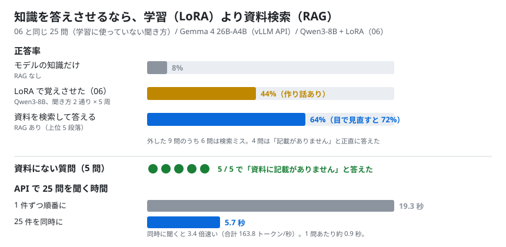
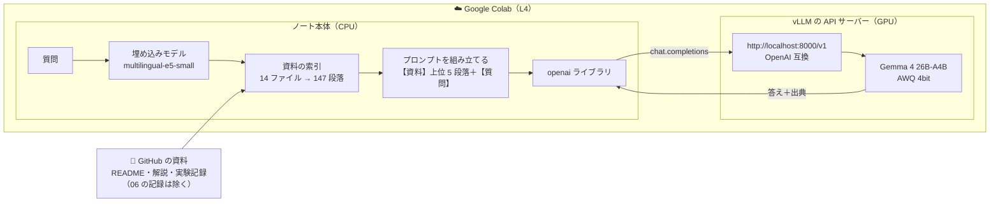

# 08. RAG・API を作る

## 結論（先に）

- **API はすぐ作れた。** vLLM で Gemma 4 26B-A4B を OpenAI 互換の API サーバーとして起動（3.4 分）し、ChatGPT と同じ `openai` ライブラリの書き方で呼べた
- **RAG（資料を検索して答える）で、06 と同じ 25 問の正答率は 64%**（採点を目で見直すと 72%）
  - モデルの知識だけ: 8% / 06 の LoRA: 44% → **LoRA より大きく良い**
  - ただし目標の 80% には届かなかった
- **外した原因の多くは検索。** 正解が書かれた段落を拾えたのは 76%。拾えなかった 6 問のうち半分は「資料に記載がありません」と正直に答えた
- **資料にない質問 5 問は、5 問とも「資料に記載がありません」と答えた。** 06 の LoRA のように作り話をしない
- **API に同時に聞くと速い。** 25 問を順番に聞くと 19.3 秒、同時に聞くと 5.7 秒（3.4 倍）。1 問あたり約 0.9 秒
- 判定は **5 つ中 3 つ合格**（想定どおりではない）。次の改善は「検索をよくする」こと
- ノート: [notebooks/08_rag_api.ipynb](../../notebooks/08_rag_api.ipynb)



## 検証の構成



### RAG とは（ひとことで）

- 質問が来たら、まず**資料の中から関係のありそうな段落を探す**（検索）
- 見つかった段落を質問といっしょにモデルに渡し、「**この資料だけを根拠に答えて**」と頼む
- モデル自体は何も学習しない。資料を差し替えれば、すぐに新しい知識で答えられる

### 何を比べたか

- 質問: [実験06](06_qlora.md) の「学習に使っていない聞き方」25 問（[データ](../../data/06_qlora_facts.json)）と、資料に答えがない 5 問
- 資料: README、解説ページ（docs/01〜06、用語集）、実験記録（01〜05、07）の 14 ファイル
  - **06 の記録は外した。** 学習後の「間違った答え」の例がたくさん載っていて、それを根拠に間違えるおそれがあるため
- 指示（システムプロンプト）: 「資料だけを根拠に答える。書かれていなければ『資料に記載がありません』と答える。最後に（出典: ファイル名）を付ける」

---

## 実行記録（Colab L4 で実行、ノートの最終セルの出力から）

- 実行日: 2026-09-25 10:23 JST
- 実行場所: Google Colab（L4, High-RAM）
- GPU: NVIDIA L4 / VRAM 22.5 GB
- モデル: cyankiwi/gemma-4-26B-A4B-it-AWQ-4bit（vLLM 0.30.0 の OpenAI 互換 API サーバー、thinking オフ、temperature 0）
- vLLM の設定: `--language-model-only --max-model-len 8192 --gpu-memory-utilization 0.92 --kv-cache-dtype fp8 --max-num-batched-tokens 2048 --max-num-seqs 16`
- サーバー起動: 3.4 分 / KV キャッシュ: 59,412 トークン
- 資料: 14 ファイル → 147 段落（06 の記録は除外）/ 埋め込み: intfloat/multilingual-e5-small（CPU）/ 上位 5 段落を渡す
- 想定どおりか: **いいえ（5 つ中 3 つ合格）**

### まとめ

| | 正答率（06 と同じ 25 問、学習に使っていない聞き方） |
|---|---|
| RAG なし（モデルの知識だけ） | 8% |
| 参考: 06 の QLoRA（学習後） | 44% |
| **RAG あり** | **64%**（目で見直すと 72%） |

- 検索が正解の書かれた段落を拾えた割合: 76%
- 資料にない質問で「記載がありません」と答えた数: **5 / 5**
- RAG ありの 1 問あたり: 入力 1,131 トークン / 出力 38 トークン / 0.89 秒
- 25 問を順番に: 19.3 秒 / 同時に: 5.7 秒（3.4 倍速い、合計 163.8 トークン/秒）

### 判定

- [x] RAG なしは 20% 以下（8%）
- [ ] RAG ありは 80% 以上 → **64%**
- [ ] 検索が正解の段落を拾えた割合が 80% 以上 → **76%**
- [x] 資料にない質問 5 問のうち 4 問以上で「記載がありません」（5 問）
- [x] 同時に聞くと、順番に聞くより合計時間が短い（3.4 倍）

### 問題ごと

「検索」は、拾った 5 段落のどれかに正解の言葉が入っていたか。

| id | 質問（要約） | RAG なし | RAG あり | 検索 | RAG ありの答え（要約） |
|---|---|---|---|---|---|
| gpu | どの GPU で動かしている？ | × | ○ | ○ | NVIDIA L4 |
| exp01_model | 最初の実験のモデルは？ | × | ○ | ○ | Qwen2.5-1.5B-Instruct |
| exp02_max | 量子化で載る最大は？ | × | ○ | ○ | Gemma 4 31B が 17.0GB、32B〜36B も載る |
| exp02_vram | 31B の VRAM は？ | × | ○ | ○ | 17.0GB（ピーク 17.2GB） |
| exp02_size | 何 GB から何 GB に？ | × | ○ | ○ | 62.5GB → 16.6GB |
| exp02_chatgpt | ChatGPT でいうと？ | × | ○ | ○ | o3 / o4-mini くらい |
| exp03_time | thinking で時間は？ | × | ○ | ○ | 約 3.6 倍（31 秒 → 111 秒） |
| exp03_acc | thinking で正解は増えた？ | × | × ※ | ○ | 「正答数は変わらず、どちらも 5/5」 |
| exp04_31b | vLLM の 31B の速さ | × | ○ | ○ | 13.3 トークン/秒（16 件で 102.9） |
| exp04_moe | MoE の速さ | × | ○ | ○ | 53.5 トークン/秒（16 件で 402.1） |
| exp04_reco | 日常使いのおすすめ | × | × | × | 資料に記載がありません |
| exp04_kv | 31B の会話の記憶の量 | × | × | ○ | 標準設定では 0.34GiB（← 失敗時の数字。正解は 2,337 トークン） |
| exp04_venv | vLLM の衝突の解決 | × | ○ | ○ | 専用の仮想環境（uv venv） |
| exp05_model | 量子化比較のモデル | × | × | × | 資料に記載がありません |
| exp05_reco | おすすめの量子化 | × | × | × | 資料に記載がありません |
| exp05_3bit | 3bit の賢さ | × | × ※ | × | 「3bit で崩れ始めます」 |
| exp05_2bit | 2bit の結果 | × | ○ | ○ | 壊れる |
| exp05_8bit | 8bit の弱点 | × | ○ | ○ | bf16 の 3 分の 1 以下と遅い |
| owner | 持ち主の GitHub 名 | × | × | ○ | 資料に記載がありません |
| numbering | 実験番号の意味 | × | × | × | 「内容を順に表している」（× 正解は「行った順」） |
| release | 最後にやること | ○ | × | × | 「Drive に保存」（× 正解は「解放」） |
| cu | CU のたとえ | × | ○ | ○ | 月ごとの回数券 |
| vram_desk | VRAM のたとえ | ○ | ○ | ○ | 作業机 |
| colab_pc | Colab のたとえ | × | ○ | ○ | 借り物のパソコン |
| kitchen | 料理のたとえ | × | ○ | ○ | 「借りた厨房で味見・調整…」（半分正解） |

※ 採点は「正解の言葉が含まれるか」で機械的に行った。exp03_acc（「変わらず」が採点の言葉に入っていなかった）と exp05_3bit（「59%」の数字がない）は、意味としては正しい。これを数えると 18 / 25 = **72%**。逆に kitchen は言葉は合っているが内容は半分正解。

RAG なしの 2 問（release、vram_desk）は、一般的な知識でたまたま当たった。

### 資料にない質問

| 質問 | 答え |
|---|---|
| Llama 3.3 70B を動かしたときの速さは？ | 資料に記載がありません。 |
| A100 を使ったときの Gemma 4 31B の速さは？ | 資料に記載がありません。 |
| 実験にかかった電気代は？ | 資料に記載がありません。 |
| 実験12の結果は？ | 資料に記載がありません。 |
| TPU を使ったときの結果は？ | 資料に記載がありません。 |

### 返事の例

```
質問: colab-oss-lab で MoE モデルを vLLM で動かしたら、どれくらいの速さでしたか。
RAG なし: 申し訳ありませんが、特定の「colab-oss-lab」というプロジェクトや実験における具体的なベンチマーク結果に関する情報は、私の学習データには含まれていません。…
RAG あり: 1件ずつ動かした場合は 53.5 トークン/秒、16件まとめて処理した場合は 402.1 トークン/秒でした。
          (出典: docs/results/04_vllm_speedup.md)
```

06 の LoRA は同じ質問に「31B（MoE）で 13.3 トークン/秒」と、別の知識を混ぜて答えていた。

```
質問: Gemma 4 31B を 4bit で L4 に載せたとき、VRAM はどれくらい使いましたか。
RAG なし: colab-oss-lab の結果によると、… VRAM 使用量は約 18GB 〜 20GB 程度です。   ← それらしい作り話
RAG あり: 読み込み後の VRAM は 17.0 GB で、生成中の VRAM ピークは 17.2 GB です。
          (出典: docs/results/02_quantization_max.md)
```

```
質問: colab-oss-lab の手順で、ノートの実行が済んだら最後にやることは何ですか。
RAG あり: 成果物（学習した追加部品など）を、Google Drive か Hugging Face に保存してください。…（出典: README.md）
```

→ 検索が「解放」の段落を拾えず、近くにあった「保存」の段落で答えてしまった。**資料に書いてあっても、検索で拾えなければ答えられない**。

---

## ふりかえり

### 分かったこと

1. **知識を答えさせるなら、LoRA より RAG。** 同じ 25 問で 44% → 64%（見直すと 72%）。学習は不要で、資料を差し替えればすぐ反映される
2. **RAG は「知らない」と言える。** 資料にない 5 問はすべて断れた。検索で拾えなかった 6 問でも、半分は「資料に記載がありません」と答えた（残りは近くの段落で答えて外した）。06 の LoRA は何でも言い切っていた
3. **RAG の弱点は検索。** 外した 9 問のうち 6 問は、正解の段落を拾えなかったのが原因。拾えた問題はほとんど正解している
4. **検索がうまくいかなかった理由**
   - どの質問にも「colab-oss-lab」という言葉が入っていて、それを多く含む README や 01 の記録が、毎回上位に来てしまった
   - 実験05の段落は表や数字が多く、「量子化の方式を比べたとき」のような言い回しと意味が近いと判断されにくかった
   - 埋め込みモデルが小さい（e5-small）
5. **API にすると、同時に使うと速い。** vLLM の API サーバーは、届いた質問をまとめて計算するので、25 問を同時に聞くと 3.4 倍速かった。1 問あたり約 0.9 秒で、チャットとして十分使える

### LoRA（06）と RAG（08）の比較

| | LoRA（06） | RAG（08） |
|---|---|---|
| 準備 | 学習データを作って学習（1.4 分＋評価） | 資料を段落に分けて索引を作る（数秒） |
| 新しい知識を足す | 学習し直す | 資料を足すだけ |
| 聞き方を変えたとき | 44% | 64%（見直すと 72%） |
| 知らないとき | 作り話で言い切る | 「資料に記載がありません」 |
| 出典 | 書き方は付くが中身は当てにならない | 実際に使った資料のファイル名 |
| 向いていること | 書き方・口調・出力の形 | 事実を答える、社内資料の案内 |

### 次にやるなら（検索をよくする）

| 対策 | ねらい |
|---|---|
| 質問から「colab-oss-lab」を外して検索する | どの質問でも README が上位に来るのを防ぐ |
| 言葉の一致でも探す（BM25 などと組み合わせるハイブリッド検索） | 「NF4」「3bit」のような言葉をそのまま拾う |
| 渡す段落を 5 → 8〜10 に増やす | 拾いもらしを減らす（入力は長くなる） |
| 大きい埋め込みモデル（bge-m3 など）や、並べ替え（リランカー）を使う | 意味の近さの判定をよくする |
| 段落に「どの実験の話か」を付けて保存する | 「実験05」「量子化の比較」などで引っかかりやすくする |

### 実行中にはまったこと（ノートは修正済み）

- **vLLM サーバーが起動の途中で止まった。** 原因は `FileNotFoundError: No such file or directory: 'ninja'`。サーバーは起動中に `ninja`（部品を組み立てる道具）を呼ぶが、仮想環境の `bin` が `PATH` に入っていなかった
  → サーバーを起動するときに `PATH` の先頭へ `/content/vllm-env/bin` を足して解決（04 のように Python から直接 vLLM を使うときは起きなかった）
- 失敗したときに、ログから本当の原因の行だけを表示するようにした

---

## 関連する解説

- [これを使うと、何ができるのか](../03-what-you-can-do.md)
- [OSSモデルを載せると、何ができるのか](../04-oss-models.md)
- [ことばの一覧（RAG・API）](../glossary.md)

← 前の実験: [07. L4 の上限を探る](07_l4_limit.md) ｜ [実験の一覧](README.md) ｜ [README](../../README.md)
