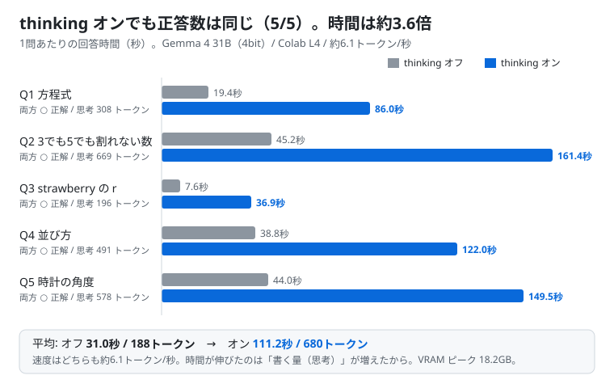
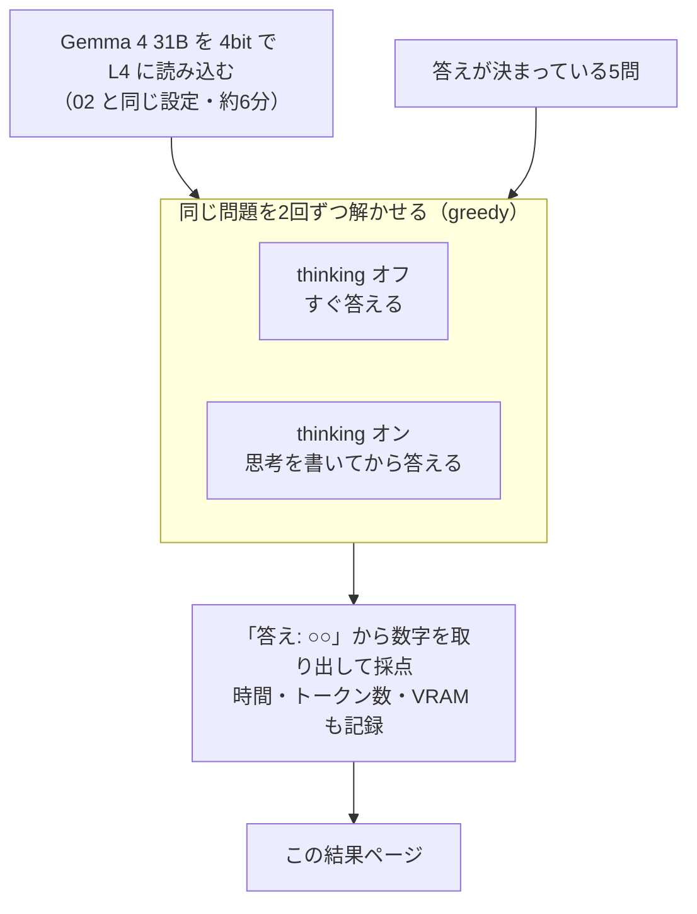

# 08. thinking（考えてから答える）のオン・オフ

## 結論（先に）

- **想定どおり動いた。** 3つの判定がすべて合格（下の実行記録）
- ただし **今回の5問では、thinking オンでも正答数は変わらなかった（どちらも 5/5）**。Gemma 4 31B は thinking オフでも途中式を書きながら解くので、この程度の問題なら十分だった
- thinking オンにすると、**1問あたりの時間が約3.6倍（31秒 → 111秒）**。生成の速さは同じ（約6.1トークン/秒）で、「思考として書く量」が増えた分だけ遅くなる
- 使い分けの目安: **ふだんはオフ。オフで間違える難しい問題のときだけオンにする**
- ノート: [notebooks/08_thinking_on_off.ipynb](../../notebooks/08_thinking_on_off.ipynb)



## 検証の流れ



thinking オンにすると、Gemma 4 はまず `<|channel>thought ... <channel|>` の中に思考を書き、そのあとに最終回答を書く。
thinking オフでは、この思考の枠が空のまま答えだけを書く。

---

## 実行記録（Colab L4 で実行、ノートの最終セルの出力）

- 実行日: 2026-09-25 02:53 JST
- 実行場所: Google Colab（L4, High-RAM）
- GPU: NVIDIA L4 / VRAM 22.0 GB
- モデル: google/gemma-4-31B-it（bitsandbytes 4bit NF4）
- transformers 5.17.0 / bitsandbytes 0.50.2 / torch 2.11.0+cu128
- 生成設定: greedy（do_sample=False）、max_new_tokens オフ 512 / オン 2048
- 読み込み時間: 6.1 分
- VRAM ピーク: 18.2 GB
- 想定どおりか: **はい**

### まとめ

| | thinking オフ | thinking オン |
|---|---|---|
| 正答数 | 5 / 5 | 5 / 5 |
| 1問あたりの時間 | 31.0 秒 | 111.2 秒 |
| 1問あたりの出力トークン | 188 | 680 |
| 速度 | 6.1 トークン/秒 | 6.1 トークン/秒 |
| 思考の途中で打ち切り | 0 | 0 |

### 判定

- [x] thinking オンの正答数がオフ以上
- [x] thinking オンのほうが時間がかかる
- [x] VRAM が 22GB に収まった

### 問題ごと

| # | 問題 | 正解 | オフ | オン | オン思考トークン | オフ秒 | オン秒 |
|---|---|---|---|---|---|---|---|
| 1 | ある数に3を足して2倍すると、その数の3倍より4小さくなります。ある数はいくつですか。 | 10 | ○ 10 | ○ 10 | 308 | 19.4 | 86.0 |
| 2 | 1から100までの整数のうち、3でも5でも割り切れないものはいくつありますか。 | 53 | ○ 53 | ○ 53 | 669 | 45.2 | 161.4 |
| 3 | 英単語 strawberry の中に、アルファベットの r は何個含まれていますか。 | 3 | ○ 3 | ○ 3 | 196 | 7.6 | 36.9 |
| 4 | A、B、C、D の4人が横一列に並びます。AとBが隣り合わない並び方は何通りですか。 | 12 | ○ 12 | ○ 12 | 491 | 38.8 | 122.0 |
| 5 | 時計が3時15分を指しているとき、長針と短針がつくる小さいほうの角は何度ですか。 | 7.5 | ○ 7.5 | ○ 7.5 | 578 | 44.0 | 149.5 |

### 返事の例（Q1、最終回答の部分）

thinking オフ:

```
ある数を $x$ とします。
問題文の内容を方程式にすると以下のようになります。
$(x + 3) \times 2 = 3x - 4$
$2x + 6 = 3x - 4$
両辺から $2x$ を引きます。 $6 = x - 4$
両辺に 4 を足します。 $10 = x$
したがって、ある数は 10 です。
答え: 10
```

thinking オン:

```
ある数を $x$ としておき、問題文から方程式を立てます。
（中略）
$2(x + 3) = 3x - 4$
$2x + 6 = 3x - 4$
$10 = x$
したがって、ある数は10です。
確認：
(10 + 3) × 2 = 13 × 2 = 26
10 × 3 - 4 = 30 - 4 = 26
となり、一致します。
答え: 10
```

全問の返事と思考の中身は、ノートを実行すると最後の2セルに出る。

---

## ふりかえり

### 分かったこと

1. **このくらいの問題なら、thinking は不要だった。** Gemma 4 31B は thinking オフでも「方程式を立てる → 解く」と途中式を書いて答えるので、それ自体が簡単な思考の代わりになっている
2. **thinking オンで増えたのは「検算」と「別の解き方」。** Q1 では答えを代入して確かめ、Q4 では「隣り合う12通りを全部書き出す」「C と D の間のすき間に入れる」という2つ目の解き方でも確かめていた。答えの信頼性は上がるが、今回の問題では結果は変わらなかった
3. **思考は英語で書かれる。** システムプロンプトで日本語を指定しても、思考部分は英語の箇条書きだった（最終回答は日本語）
4. **thinking オンでも小さなミスは出る。** Q2 のオンの回答で、見出しが「5で割り切れない数の個数」になっていた（中身の計算は「5で割り切れる数」で正しい）。thinking は「答えの数字」には効くが、文章の細かい誤りまでは防げない
5. **速さは変わらない。** 1トークンを作る速さはどちらも約6.1トークン/秒。時間の差は、ほぼすべて出力の長さの差

### 想定と違ったところ

- 「thinking オンのほうが正答数が多い」ことを期待していたが、差が出なかった。問題が、31B のモデルには易しすぎた
- 02 のモデルカードの数値（AIME など）は thinking オンの値と考えられる。差を見るには、もっと難しい問題（数学オリンピック級、長い条件の論理パズル、複数ステップのプログラム読解など）が必要

### 実行中に直した不具合

- 最初の実行で、thinking オフの返事を「思考の途中で打ち切られた」と誤判定した。Gemma 4 のチャットテンプレートは、thinking オフのときに **空の思考枠 `<|channel>thought\n<channel|>` を入力側に入れる**ため、出力には `<channel|>` が出てこないのが原因
- ノートを修正してプッシュしたうえで、読み込み済みのモデルを使って問題のセルから再実行した。この記録は修正後の結果

### 次にやるなら

- 難しい問題セットで、もう一度オン・オフを比べる（差が出る問題を探す）
- thinking の長さ（思考に使うトークンの上限）を変えて、時間と正答率のバランスを見る
- 03（vLLM で高速化）で速度が上がれば、thinking オンの待ち時間の問題も小さくなる
