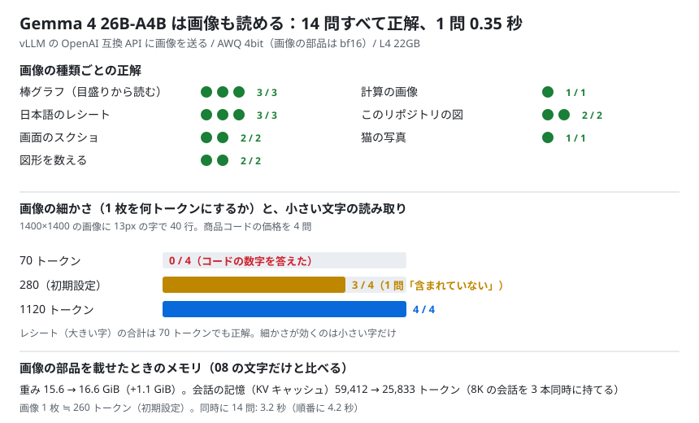
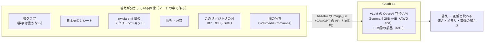

# 09. 画像も入れてみる

## 結論（先に）

- **想定どおり動いた。** 5つの判定がすべて合格（下の実行記録）
- **Gemma 4 26B-A4B（AWQ 4bit）は、L4 1枚で画像も読める。** グラフ・日本語のレシート・画面のスクリーンショット・図形・計算・このリポジトリの図・写真の **14 問すべて正解**
- **速い。** 1 問あたり **0.35 秒**（画像 1 枚は約 260 トークン）。ChatGPT の API と同じ `image_url` の書き方で送れる
- 画像の部品を載せるコスト: 重みが **+1.1 GiB**、会話の記憶（KV キャッシュ）が 59,412 → **25,833 トークン**。それでも 8K の会話を 3 本同時に持てる
- **小さい字は「画像の細かさ」しだい。** 1 枚を 70 トークンにすると小さい字は 0/4、280（初期設定）で 3/4、1120 で 4/4
- 起動で 1 回つまずいた: 画像 1 枚は最大 2,496 トークンになるので、08 の設定（一度に処理する量 2,048）のままでは起動しない → 4,096 に上げて解決
- ノート: [notebooks/09_image_input.ipynb](../../notebooks/09_image_input.ipynb)



## 検証の構成



08 との違い（それ以外の設定は同じ）:

| | 08（文字だけ） | 09（画像あり） |
|---|---|---|
| 画像の部品 | 読み込まない（`--language-model-only`） | **読み込む** |
| 一度に処理する量（`--max-num-batched-tokens`） | 2,048 | **4,096**（画像 1 枚が最大 2,496 トークンのため） |
| 1 回に送れる画像 | - | 1 枚（`--limit-mm-per-prompt '{"image": 1}'`） |

---

## 実行記録（Colab L4 で実行、ノートの最終セルの出力）

- 実行日: 2026-09-25 11:25 JST
- 実行場所: Google Colab（L4）
- GPU: NVIDIA L4 / VRAM 22.5 GB
- モデル: `cyankiwi/gemma-4-26B-A4B-it-AWQ-4bit`（vLLM 0.30.0 の OpenAI 互換 API サーバー、画像の部品あり、thinking オフ、temperature 0）
- サーバー起動: 6.9 分 / 重み: 16.64 GiB / KV キャッシュ: 25,833 トークン（08 の文字だけ: 59,412）/ nvidia-smi: 20.27 GB
- 画像 1 枚 ≒ 262 トークン（初期設定）
- 想定どおりか: **はい**

### まとめ

| 項目 | 結果 |
|---|---|
| 14 問の正答率 | **100%**（14 / 14） |
| 1 問あたり | **0.35 秒** / 入力 287 トークン |
| 14 問を順番に / 同時に | 4.2 秒 / 3.2 秒（1.3 倍） |
| 重み（04 の文字だけ → 09） | 15.56 GiB → 16.64 GiB（+1.1 GiB） |
| KV キャッシュ（08 → 09） | 59,412 → 25,833 トークン |

### 判定

- [x] 画像の部品を入れても L4 に載る（サーバーが起動する）
- [x] 14 問のうち 80% 以上正解
- [x] 日本語の文字（レシート）を読める
- [x] 画像 1 枚あたり 5 秒以内で答える
- [x] 画像を細かくすると、小さい文字の問題の正解が増える（または減らない）

### 問題ごと

| 画像 | 質問 | 正誤 | 答え | 秒 |
|---|---|---|---|---|
| 棒グラフ | いちばん多い果物は？ | ○ | みかん | 0.3 |
| 棒グラフ | ぶどうはおよそ何個？（正解 25） | ○ | 25 | 0.1 |
| 棒グラフ | ももはおよそ何個？（正解 51） | ○ | 51 | 0.1 |
| レシート | たまごサンドはいくら？ | ○ | たまごサンドは680円です。 | 0.4 |
| レシート | 合計金額は？ | ○ | 合計金額は **¥1,650** です。 | 0.3 |
| レシート | お店の名前は？ | ○ | このお店の名前は「カフェ ひまわり」です。 | 0.3 |
| スクショ | GPU の名前は？ | ○ | この画面に表示されている GPU の名前は **NVIDIA L4** です。 | 0.6 |
| スクショ | メモリは何 MiB 使われている？ | ○ | 17034 | 0.2 |
| 図形 | 赤い丸はいくつ？ | ○ | 7 | 0.3 |
| 図形 | 青い四角はいくつ？ | ○ | 4 | 0.1 |
| 計算 | 23 × 17 の答えは？ | ○ | 391 | 0.3 |
| 07 の図 | Seed-OSS-36B の VRAM は何 GB？ | ○ | この図によると、Seed-OSS-36B のモデル本体（青色の部分）は **19.64 GB** です。 | 0.6 |
| 08 の図 | RAG ありの正答率は何 %？ | ○ | この図によると、RAG ありの正答率は **64%** です。（注釈として、目で見直すと 72% になるとも記載されています） | 1.0 |
| 写真 | 写っている動物は？ | ○ | 猫 | 0.3 |

棒グラフには数字を書いていない（目盛りだけ）が、25・51 とぴったり読めた。

### 画像の細かさ（小さい文字の表 4 問 + レシートの合計）

1400×1400 の画像に 13px の字で「商品コードと価格」を 40 行書き、4 つのコードの価格を聞いた。

| 1 枚のトークン数（`max_soft_tokens`） | 入力トークン | 小さい文字 | レシート | 1 問の秒 |
|---|---|---|---|---|
| 70 | 99 | 0 / 4 | ○ | 0.2 |
| 280 | 291 | 3 / 4 | ○ | 11.1 |
| 1120 | 1,124 | 4 / 4 | ○ | 11.9 |

- 70: 価格ではなく **商品コードの数字** を答えた（B-8367 → 8367）。字がつぶれて表の形しか見えていない
- 280: 1 問だけ「このリストには商品コード A-1542 は含まれていません」
- 1120: 4 問とも正解
- 280・1120 の 1 問 11〜12 秒は、初期設定の 14 問（ほぼ同じ 280 トークン）の 0.35 秒よりずっと遅い。新しい大きさの画像を初めて処理するときの準備（コンパイル）が入ったためと思われる（未確認）

### 説明させた例

猫の写真（2 文で）:

```
オレンジ色の毛並みが美しい猫が、こちらをじっと見つめています。
背景には赤い線が引かれた地面が見えます。
```

スクリーンショット（初心者向けに 3 文で）:

```
1. GPUの稼働状況： NVIDIA L4という高性能なGPUが動いており、温度は61度、電力は58Wを使用しています。
2. メモリの使用量： 約23GBあるメモリのうち、約17GBがすでに使われており、容量の多くが消費されています。
3. 実行中のプログラム： 「python3 (vllm)」というプログラムが、メモリの大部分（約16.9GB）を占有して動作しています。
```

08 の図（伝えたいことを 3 文で）:

```
1. 知識を答えさせる場合、モデルの学習（LoRA）よりも資料検索（RAG）を用いる方が正答率が大幅に向上します。
2. LoRAによる学習では44%（作り話を含む）にとどまるのに対し、RAGを用いると正答率は64%（見直しにより72%）まで高まります。
3. RAGは、資料にない質問に対して「記載がない」と正しく回答できるため、誤情報の生成（ハルシネーション）を抑制する効果もあります。
```

07 の図（自由に説明、冒頭）:

```
この画像は、NVIDIA L4 GPU（VRAM 22GB）を使用して、4bit量子化された大規模言語モデル（LLM）をロードした際の、
メモリ使用量のシミュレーション結果を示したグラフです。
…「L4 GPU（22GB）に4bitで載せられるモデルの限界は、パラメータ数約36B（360億）である」ということを示しています。
```

色の意味（青 = モデル本体、黄 = 追加分、灰 = 空き、赤い点線 = 22GB）まで正しく読めた。ただし「**シミュレーション結果**」は誤り（実際に測った値）。図から読めないことは、もっともらしく補ってしまう。

---

## ふりかえり

### 分かったこと

1. **画像の部品は軽い。** 重みの増加は 1.1 GiB だけ。L4 で動く 26B-A4B に、そのまま目を付けられる
2. **グラフ・表・スクショのような「文字と数字の画像」に強い。** 目盛りからの読み取り、日本語の OCR、数える、計算まで、易しい問題なら取りこぼしなし
3. **細かい字は `max_soft_tokens` を上げる。** 初期設定（280）で足りないときは 1120 にすると読めた。大きい字の画像なら 70 でも十分で、そのぶん速く軽い
4. **会話の記憶は半分以下になる。** 画像を処理する作業場所の分、KV キャッシュが 59,412 → 25,833 トークンに減った。RAG（[08](08_rag_api.md)）のように長い資料を大量に同時に入れる使い方では、画像がいらないなら `--language-model-only` のほうが得
5. **図の説明はうまいが、図にないことも言い切る。** 数字の読み取りは正確でも、「シミュレーション」のような背景の説明は推測が混ざる。ここは [08](08_rag_api.md) の RAG と同じく「根拠のある部分だけを使う」意識が必要

### 実行中の注意

- **`--max-num-batched-tokens` は 2,496 以上にする。** 08 の 2,048 のままだと `Chunked MM input disabled but max_tokens_per_mm_item (2496) is larger than max_num_batched_tokens (2048)` で起動が止まる（55 秒で落ちた）。ノートでは 4,096 にした
- **Colab には `DejaVuSansMono.ttf` が `/usr/share/fonts` に入っていない。** スクリーンショット風の画像を作るのに、matplotlib が持っている等幅フォントを使うように直した
- 画像の細かさはリクエストごとに `extra_body={"mm_processor_kwargs": {"max_soft_tokens": 1120}}` で変えられる
- サーバー起動は 6.9 分（08 は 3.4 分）。画像の部品の準備とコンパイルの分だけ長い

### 次にやるなら

- **難しい画像**: 手書き、写真の中の看板、複雑な表や数式、複数ページの PDF
- 画像 **2 枚以上** を比べさせる（`--limit-mm-per-prompt` を増やす。そのぶん KV キャッシュは減る）
- **画像 + RAG**: スクリーンショットで質問して、このリポジトリの資料で答える
- 31B（密）で同じ 14 問＋もっと難しい問題を解かせ、26B-A4B との差を見る（[04](04_vllm_speedup.md) のとおり 31B は KV キャッシュが苦しい）

---

## 関連する解説

- [これを使うと、何ができるのか（画像や音声など、文章以外も試せる）](../03-what-you-can-do.md)
- [OSSモデルを載せると、何ができるのか](../04-oss-models.md)
- [ことばの一覧（マルチモーダル・画像トークン）](../glossary.md)

← 前の実験: [08. RAG・API を作る](08_rag_api.md) ｜ 次の実験: [10. RAG の検索をよくする](10_rag_retrieval.md) → ｜ [実験の一覧](README.md) ｜ [README](../../README.md)
