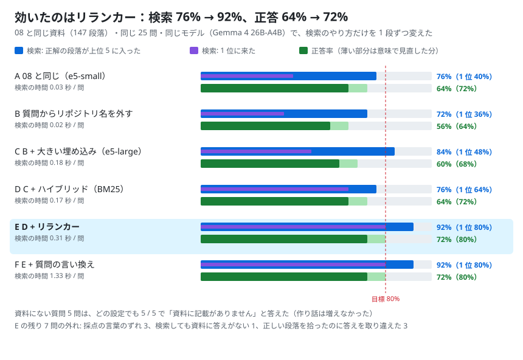
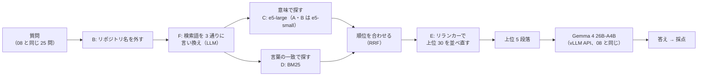

# 10. RAG の検索をよくする

## 結論（先に）

- **想定どおりではなかった（4 つ中 3 つ合格）。** 検索は目標を超えたが、正答率は 72% で 80% に届かなかった
- **効いたのはリランカー。** 候補の 30 段落を `bge-reranker-v2-m3` で並べ直すと、検索（正解の段落が上位 5 に入る）が **76% → 92%**、1 位に来る割合が **40% → 80%** になった
- 正答率は **64% → 72%**。採点の言葉のずれを直すと 80%、目で見直すと **84%**（21 / 25）
- **資料にない質問は、どの設定でも 5 / 5 で「記載がありません」。** 検索を強くしても作り話は増えなかった
- 効かなかったこと:
  - **質問から「colab-oss-lab」を外すだけ** → README が上位 5 に入る数は半分（2.1 → 1.0）になったが、検索は 76% → 72% と少し下がった
  - **質問の言い換え**（モデルに検索語を 3 通り作らせる）→ 検索も正答も変わらず、時間だけ 4 倍（0.31 → 1.33 秒）
- 残りの外れは **検索ではなく答える側**（正しい段落を拾ったのに数字や言葉を取り違える）と、採点・資料の問題
- ノート: [notebooks/10_rag_retrieval.ipynb](../../notebooks/10_rag_retrieval.ipynb)

## 検証の構成

A から F まで、1 段ずつ部品を足していった。

| 設定 | 変えること |
|---|---|
| A | 08 と同じ（e5-small、上位 5 段落） |
| B | 質問から「colab-oss-lab」などのリポジトリ名を外して検索する |
| C | B ＋ 大きい埋め込みモデル（`multilingual-e5-large`） |
| D | C ＋ ハイブリッド検索（言葉の一致で探す BM25 と、意味で探す埋め込みを合わせる） |
| E | D ＋ リランカー（上位 30 段落を `bge-reranker-v2-m3` で並べ直す） |
| F | E ＋ 質問の言い換え（モデルに検索語を 3 通り作らせてから探す） |

比べられるように、**08 と同じもの** を使った。

- 資料: 08 を実行したときのリポジトリ（コミット `e4570f0` に固定）の 14 ファイル → 147 段落
- 質問と採点: 06・08 と同じ 25 問 ＋ 資料にない 5 問、「正解の言葉が答えに入っているか」
- 設定 A は 08 と同じ数字（検索 76%・正答 64%）を再現した

---

## 実行記録（Colab L4 で実行、ノートの最終セルの出力）

- 実行日: 2026-09-25 11:54 JST
- 実行場所: Google Colab（L4, High-RAM）
- GPU: NVIDIA L4 / VRAM 22.5 GB
- モデル: `cyankiwi/gemma-4-26B-A4B-it-AWQ-4bit`（vLLM 0.30.0 の OpenAI 互換 API、thinking オフ、temperature 0、gpu-memory-utilization 0.90）
- サーバー起動: 3.4 分 / KV キャッシュ: 52,647 トークン
- 検索の部品: `intfloat/multilingual-e5-small`（CPU）/ `intfloat/multilingual-e5-large`（CPU）/ BM25（日本語は 2 文字ずつ区切る）/ `BAAI/bge-reranker-v2-m3`（GPU, fp16）
- GPU の使用量: 21,814 / 23,034 MiB（vLLM ＋ リランカー）
- いちばん良い設定: **E（D + リランカー）**
- 想定どおりか: **いいえ（4 つ中 3 つ合格）**

### まとめ

| 設定 | 検索 1 位 | 検索 上位 5 | 検索 上位 10 | MRR | 正答率 | 正答率（広げた採点） | 資料にない質問で断る | 上位 5 の README | 検索の時間 / 問 |
|---|---|---|---|---|---|---|---|---|---|
| A: 08 と同じ（e5-small） | 40% | 76% | 84% | 0.56 | 64% | 72% | 5 / 5 | 2.1 | 0.03 秒 |
| B: 質問からリポジトリ名を外す | 36% | 72% | 84% | 0.54 | 56% | 64% | 5 / 5 | 1.0 | 0.02 秒 |
| C: B + 大きい埋め込み（e5-large） | 48% | 84% | 84% | 0.61 | 60% | 68% | 5 / 5 | 1.2 | 0.18 秒 |
| D: C + ハイブリッド（BM25） | 64% | 76% | 80% | 0.70 | 64% | 72% | 5 / 5 | 1.2 | 0.17 秒 |
| **E: D + リランカー** | **80%** | **92%** | **92%** | **0.84** | **72%** | **80%** | 5 / 5 | 1.2 | 0.31 秒 |
| F: E + 質問の言い換え | 80% | 92% | 92% | 0.84 | 72% | 80% | 5 / 5 | 1.4 | 1.33 秒 |

- MRR: 正解の段落が何位に来たかの平均（1 位なら 1、2 位なら 0.5…）。1 に近いほど上のほうで見つかる
- 広げた採点: 08 で「意味は合っているのに ×」だった 2 問（exp03_acc「変わらず」、exp05_3bit「崩れ」）の言葉を足したもの

### 判定

- [x] 検索が正解の段落を拾えた割合（上位 5）が 90% 以上 → **92%**（E）
- [ ] RAG の正答率が 80% 以上 → **72%**（E。広げた採点で 80%、目で見直すと 84%）
- [x] 資料にない質問 5 問のうち 4 問以上で「記載がありません」→ **5 / 5**
- [x] 1 問あたりの検索が 1 秒以内 → **0.31 秒**（E）

### 問題ごと（正解の段落の順位 / 正誤）

「-」は上位 10 に正解の段落が無かったもの。

| id | A | B | C | D | E | F |
|---|---|---|---|---|---|---|
| gpu | 1 ○ | 2 ○ | 1 ○ | 1 ○ | 1 ○ | 1 ○ |
| exp01_model | 3 ○ | 2 ○ | - × | - × | 1 ○ | 1 ○ |
| exp02_max | 1 ○ | 2 ○ | 2 ○ | 1 ○ | 1 × | 1 × |
| exp02_vram | 1 ○ | 6 × | 5 × | 1 ○ | 1 ○ | 1 ○ |
| exp02_size | 1 ○ | 1 ○ | 2 ○ | 1 ○ | 1 ○ | 1 ○ |
| exp02_chatgpt | 1 ○ | 1 ○ | 1 ○ | 1 ○ | 1 ○ | 1 ○ |
| exp03_time | 1 ○ | 2 ○ | 1 ○ | 1 ○ | 1 ○ | 1 ○ |
| exp03_acc | 3 × | 1 × | 1 × | 1 × | 1 × | 1 × |
| exp04_31b | 1 ○ | 1 ○ | 1 ○ | - × | 1 ○ | 1 ○ |
| exp04_moe | 3 ○ | 2 ○ | 1 ○ | 1 ○ | 1 ○ | 1 ○ |
| exp04_reco | - × | - × | 3 × | 9 × | 1 ○ | 1 ○ |
| exp04_kv | 1 × | 1 × | 1 × | 1 × | 1 × | 1 × |
| exp04_venv | 1 ○ | 1 ○ | 1 ○ | 1 ○ | 1 ○ | 1 ○ |
| exp05_model | 6 × | 7 × | 5 ○ | 3 ○ | 5 ○ | 5 ○ |
| exp05_reco | 8 × | 2 × | 2 ○ | 1 ○ | 1 ○ | 1 ○ |
| exp05_3bit | - × | - × | - × | - × | - × | - × |
| exp05_2bit | 2 ○ | 1 ○ | 3 × | 2 × | 1 ○ | 1 ○ |
| exp05_8bit | 2 ○ | 1 ○ | 1 ○ | 2 ○ | 1 ○ | 1 ○ |
| owner | 2 × | - × | - × | - × | 2 × | 2 × |
| numbering | - × | 1 ○ | 1 ○ | 1 ○ | 1 ○ | 1 ○ |
| release | - × | - × | - × | - × | - × | - × |
| cu | 1 ○ | 3 ○ | 1 ○ | 1 ○ | 1 ○ | 1 ○ |
| vram_desk | 2 ○ | 2 × | 4 ○ | 1 ○ | 3 ○ | 3 ○ |
| colab_pc | 2 ○ | 3 ○ | 1 × | 1 ○ | 1 × | 1 × |
| kitchen | 5 ○ | 10 × | 2 ○ | 1 ○ | 1 ○ | 1 ○ |

### A で × → E で ○ になった問題

| id | A（08 と同じ）の答え | E の答え |
|---|---|---|
| exp04_reco | 資料に記載がありません。 | vLLM + Gemma 4 26B-A4B（AWQ 4bit）がおすすめです。 |
| exp05_model | Gemma 4 31B-it（bitsandbytes 4bit）です。 | Qwen/Qwen3-8B です。 |
| exp05_reco | 資料に記載がありません。 | 普段使いには、bitsandbytes NF4 がおすすめとされています。 |
| numbering | 「これまでの実験」の表における各実験の順序を表しています。 | 実験の番号は、行った順を表しています。 |

08 で「検索ミスで外した」問題が、そのまま正解に変わった。

### E で × の 7 問（中身を見直した）

| id | 正解の段落の順位 | E の答え | 見直し |
|---|---|---|---|
| exp02_max | 1 | L4 に 4bit で GPU だけに載る上限は、36B の密モデルです。 | **正しい。** 06 で作った正解（31B）は実験 07 の前のもの。資料には 07 の「36B」が載っている → 採点の言葉が古い |
| exp03_acc | 1 | thinking オンでも正答数は変わらず、どちらも 5/5 でした。 | **正しい。** 採点の言葉に「変わらず」が無い（広げた採点では ○） |
| exp05_3bit | 10 位以内になし | 3bit では崩れ始めます。PPL が +50〜60% となり、10 問中 5 問に低下します。 | **正しい。** 採点の言葉「59」（+59.3%）は表の中にだけあり、その段落は拾えなかったが、別の段落から正しく答えた（広げた採点では ○） |
| release | 10 位以内になし | ノートを閉じても、手順がこのリポジトリに残っている状態にすることです。 | **×。** 「解放」は資料（docs と README）に書かれていなかった（ノートの中にだけある）。「記載がありません」と言うべきところを、近い段落から答えた |
| exp04_kv | 1 | 標準設定では、会話の記憶に 0.34 GiB しか残りませんでした。 | **×。** 正しい段落を拾ったのに、失敗したときの数字を答えた（正解は設定を変えた後の 2,337 トークン） |
| owner | 2 | 資料に記載がありません。 | **×。** ユーザー名は Colab のリンクの URL の中にだけあり、読み取れなかった |
| colab_pc | 1 | Colab は「厨房を借りて、自分で料理してみる」ことです。 | **×。** 同じ表にある別のたとえ（料理）と取り違えた |

- 上の 3 問を正解に数えると 21 / 25 = **84%**
- 残りの 4 問のうち、**検索のせいなのは 0 問**（release は資料に答えが無い）。どれも「答え方」か「資料の書き方」の問題

### 資料にない質問（E）

| 質問 | 答え |
|---|---|
| Llama 3.3 70B を動かしたときの速さは？ | 資料に記載がありません。 |
| A100 を使ったときの Gemma 4 31B の速さは？ | 資料に記載がありません。 |
| 実験にかかった電気代は？ | 資料に記載がありません。 |
| 実験12の結果は？ | 資料に記載がありません。 |
| TPU を使ったときの結果は？ | 資料に記載がありません。 |

### 質問の言い換えの例（F）

| 質問 | モデルが作った検索語 |
|---|---|
| colab-oss-lab のたとえで、CU とは何ですか。 | colab-oss-lab CU とは / colab-oss-lab CU 意味 / colab-oss-lab CU 例え |
| このリポジトリの実験は、どの GPU で動かしていますか。 | 実験 使用 GPU / 実行環境 GPU モデル / GPU スペック 確認 |
| Gemma 4 31B を 4bit で L4 に載せたとき、VRAM はどれくらい使いましたか。 | Gemma 4 31B 4bit VRAM 使用量 / … L4 GPU メモリ消費 / … VRAM 推定値 |

「リポジトリ名は入れない」と指示したのに、入れてしまうことがあった。言い換えは元の質問とほぼ同じ言葉になり、新しい手がかりを足せていない。

---

## ふりかえり

### 分かったこと

1. **いちばん効くのはリランカー。** 埋め込み（意味で探す）は「だいたい近い」段落を集めるのは得意だが、並べる順番が荒い。質問と段落を 1 組ずつ読み比べるリランカーを最後に入れると、1 位に正解が来る割合が 40% → 80% と倍になった。1 問 0.3 秒、GPU は約 1GB で済む
2. **「README が邪魔」は原因の半分だけだった。** リポジトリ名を外すと README は減ったが、e5-small では検索が良くならなかった。小さい埋め込みモデルにとっては、名前が「このリポジトリの話」という手がかりにもなっていた
3. **部品を足すと、順位の「形」が変わる。** 大きい埋め込み（C）は上位 5 に入る割合（84%）、BM25（D）は 1 位（64%）を上げた。混ぜただけの D は上位 5 が 76% に下がったが、リランカーで並べ直すとどちらの良さも活きた
4. **検索が良くなっても、正答率はそのままでは上がらない。** C は検索 84% でも正答 60%。E で検索 92% になっても、残りの外れは「正しい段落を読んで、違う数字を答える」ものだった。ここから先は **答え方（プロンプト・資料の書き方・モデル）** の問題
5. **採点の仕組みも見直しが要る。** 「正解の言葉が入っているか」だけだと、資料が更新された問題（31B → 36B）や言い換え（「変わらず」）を × にする。機械の採点と、目での見直しを両方残すのが大事
6. **検索を強くしても、作り話は増えなかった。** 資料にない質問は全設定で 5 / 5 断れた

### おすすめの組み合わせ（このリポジトリくらいの資料の量なら）

| 部品 | おすすめ | 理由 |
|---|---|---|
| 埋め込み | `multilingual-e5-large`（CPU で十分） | 147 段落なら CPU でも 1 分かからない |
| 言葉の一致 | BM25（2 文字区切り） | 数字や型番（26B-A4B、NF4）に強い |
| 並べ直し | **`bge-reranker-v2-m3`**（GPU、fp16） | いちばん効く。1 問 0.3 秒 |
| 質問の言い換え | 使わない | 効果なし・4 倍遅い |

### 実行中の注意

- **最初は vLLM の `--gpu-memory-utilization` を 0.80 にして、起動に失敗した。** `ValueError: To serve at least one request with the model's max seq len (8192) ...`。重みと作業用メモリで 0.80 をほぼ使い切り、会話の記憶が 8,192 トークン分も残らなかった。0.90 にして、埋め込みは CPU、リランカーだけ GPU の空きに載せた（KV キャッシュは 52,647 トークン残った）
- 資料は `raw.githubusercontent.com/moruku36/colab-oss-lab/e4570f0/…` のように **コミットを固定して** 取った。main から取ると、08 の後に増えた記録（08・09 の結果）が混ざって比べられない

### 次にやるなら

- **答え方をよくする**: 「数字は資料の表から、条件（どの設定の数字か）もそえて答える」ようにプロンプトを変える。31B（密）や thinking オンで答えさせる
- **資料の書き方をよくする**: 「最後にランタイムを解放する」「持ち主は moruku36」など、ノートやリンクの中にしかない事実を文章でも書く。表は 1 行ずつ段落にする
- **採点をよくする**: 言葉の一致に加えて、モデルに「正解と同じ意味か」を判定させる（LLM で採点）

---

## 関連する解説

- [これを使うと、何ができるのか](../03-what-you-can-do.md)
- [OSSモデルを載せると、何ができるのか](../04-oss-models.md)
- [ことばの一覧（RAG・埋め込み・BM25・リランカー）](../glossary.md)

← 前の実験: [09. 画像も入れてみる](09_image_input.md) ｜ [実験の一覧](README.md) ｜ [README](../../README.md)
